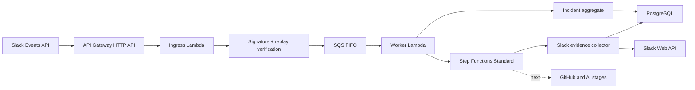

# Incident Evidence Copilot

Incident Evidence Copilot is an evidence-first foundation for reconstructing
production incidents from Slack and engineering systems. It is deliberately not
a one-prompt transcript summarizer: incident facts, hypotheses, timeline events,
and evidence references are represented as separate domain concepts so later AI
stages cannot silently turn speculation into fact.

The current release establishes secure ingestion and collects the triggering
public Slack thread into a deterministic, retention-bound evidence bundle.
Selected-channel collection, GitHub retrieval, model inference, and the human
review console are later vertical increments.

## Implemented

- Authenticated Slack Events API endpoint with HMAC verification, constant-time
  comparison, and five-minute replay protection.
- `@app generate incident review: <title>` and equivalent RCA/postmortem command
  parsing for public channels.
- Immediate Slack acknowledgement followed by durable SQS FIFO handoff.
- API Gateway HTTP API and Lambda adapters which preserve the same application
  contracts as the local Fastify API and polling worker.
- Versioned queue contract with rapid-retry deduplication and Lambda partial
  batch failure handling for FIFO ordering.
- At-least-once worker with database-backed idempotency, optimistic locking, and
  deterministic Step Functions execution identity.
- Checkpointed Slack thread collection in bounded 15-message pages, with
  provider-directed rate-limit waits owned by Step Functions rather than a
  sleeping Lambda.
- Idempotent Slack evidence upserts with stable source IDs, SHA-256 content
  hashes, source permalinks, selected metadata, and configurable retention
  deadlines.
- Secrets Manager runtime loading with narrow, validated JSON secret contracts.
- Terraform for API Gateway, three independently scaled Lambdas, encrypted SQS
  FIFO/DLQ, a checkpointed Standard workflow, least-privilege IAM, bounded
  logs, concurrency controls, and queue/workflow alarms.
- Incident aggregate with explicit, validated lifecycle transitions.
- PostgreSQL schema for tenants, installations, incidents, source artifacts,
  timeline events, claims, evidence links, workflow jobs, and audit events.
- Transactional, checksummed SQL migrations protected by an advisory lock.
- Structured AI analysis contract that rejects references to unknown evidence.
- Redacted structured logging, health endpoints, graceful shutdown, CI, Docker,
  and reproducible local PostgreSQL/SQS services.

## Architecture



Production uses serverless protocol adapters; local development retains the
Fastify API and polling worker. Both paths compose the same application services
and domain rules from one modular codebase. This isolates Slack's short response
deadline from durable processing without duplicating business logic. See
[architecture](docs/architecture.md), [serverless deployment](infrastructure/terraform/README.md),
[threat model](docs/threat-model.md), and [roadmap](docs/roadmap.md).

## Requirements

- Node.js 22+
- A `zip` command-line utility for Lambda packaging
- Docker with Compose
- A development Slack app for live Slack events

## Local setup

Install dependencies and start PostgreSQL plus LocalStack SQS:

```bash
npm install
docker compose up -d
cp .env.example .env
```

Load the environment, apply migrations, then start the API and worker in
separate terminals:

```bash
set -a
source .env
set +a
npm run db:migrate
npm run dev:api
```

```bash
set -a
source .env
set +a
npm run dev:worker
```

Configure the Slack app's Events API request URL as:

```text
https://<public-development-url>/integrations/slack/events
```

Subscribe to `app_mention`, grant the bot `app_mentions:read`, `chat:write`, and
`channels:history`, reinstall the app after changing scopes, invite it to a
public development channel, and send:

```text
@IncidentCopilot generate incident review: Checkout outage
```

The production worker creates the incident idempotently, advances it to
`COLLECTING`, starts the durable workflow, and posts an idempotent acceptance
reply in the triggering Slack thread. The workflow retrieves that thread,
filters the product's operational status reply, stores canonical message
artifacts, and checkpoints progress after every page.

## Engineering checks

```bash
npm run check
```

The command runs formatting verification, ESLint with type-aware rules, strict
TypeScript checking, the test suite, the Node.js build, and a reproducible Lambda
ZIP build.

## AWS deployment foundation

Build the shared Lambda artifact:

```bash
npm run build:lambda
```

This produces the ignored artifact
`artifacts/incident-copilot-lambda.zip`, containing three composition roots:
`slack-ingress-main.handler`, `incident-worker-main.handler`, and
`slack-evidence-collector-main.handler`. Terraform instructions, required
secret shapes, networking assumptions, cost controls, and deployment gates are in
[infrastructure/terraform/README.md](infrastructure/terraform/README.md).

The Terraform is not proof that this repository is already deployed. It also
does not provision PostgreSQL, the Slack app, or remote Terraform state. The
current hosted path uses an existing Supabase transaction pooler with its CA
certificate verified by the worker. Those inputs must exist before the AWS path
can process a real incident. The current Step Functions definition collects
only the triggering Slack thread; selected-channel discovery, AI analysis, and
publication are not implemented yet.

## Security posture

- Request bodies are authenticated before JSON parsing.
- Slack event payloads and source message text are never written to normal logs.
- Private channels and direct messages are rejected in the initial release.
- Queue delivery is assumed to be at-least-once; database uniqueness is the
  durable idempotency boundary.
- Tenant IDs are present in every persistent relationship and repository query.
- Model output can suggest claims but cannot grant access or publish reports.

This is a foundation, not a completed security certification. The OAuth
installation flow, bot-token encryption, source ACL lookup, and destination ACL
checks must be completed before onboarding external workspaces.

## Project status

The next product increments are:

1. Add an incident-scoping flow for time windows and explicitly selected public
   channels, plus a source-coverage manifest.
2. Enforce retention expiry with a deletion processor and handle Slack
   revocation/uninstall events.
3. Integrate a GitHub App for deployments, commits, pull requests, and workflows.
4. Extract structured timeline events and claims using a schema-constrained model.
5. Render an evidence-linked review rather than publishing automatically.

The project intentionally excludes Kubernetes, Kafka, a vector database, a graph
database, autonomous root-cause claims, private-channel ingestion, and automated
remediation until measured requirements justify them.
