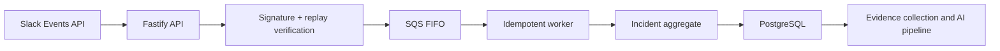

# Incident Evidence Copilot

Incident Evidence Copilot is an evidence-first foundation for reconstructing
production incidents from Slack and engineering systems. It is deliberately not
a one-prompt transcript summarizer: incident facts, hypotheses, timeline events,
and evidence references are represented as separate domain concepts so later AI
stages cannot silently turn speculation into fact.

The current release establishes the secure ingestion and durable workflow
foundation. Slack collection, GitHub evidence retrieval, model inference, and
the human review console are the next vertical increments.

## Implemented

- Authenticated Slack Events API endpoint with HMAC verification, constant-time
  comparison, and five-minute replay protection.
- `@app generate incident review: <title>` and equivalent RCA/postmortem command
  parsing for public channels.
- Immediate Slack acknowledgement followed by durable SQS FIFO handoff.
- Versioned queue contract with rapid-retry deduplication.
- At-least-once worker with database-backed idempotency and optimistic locking.
- Incident aggregate with explicit, validated lifecycle transitions.
- PostgreSQL schema for tenants, installations, incidents, source artifacts,
  timeline events, claims, evidence links, workflow jobs, and audit events.
- Transactional, checksummed SQL migrations protected by an advisory lock.
- Structured AI analysis contract that rejects references to unknown evidence.
- Redacted structured logging, health endpoints, graceful shutdown, CI, Docker,
  and reproducible local PostgreSQL/SQS services.

## Architecture



The API and worker are separate process entrypoints in one modular codebase.
This isolates Slack's short response deadline from long-running processing while
keeping domain and deployment complexity low. See [architecture](docs/architecture.md),
[threat model](docs/threat-model.md), and [roadmap](docs/roadmap.md).

## Requirements

- Node.js 22+
- Docker with Compose
- A development Slack app for live Slack events

## Local setup

Install dependencies and start PostgreSQL plus LocalStack SQS:

```bash
npm install
docker compose up -d
cp .env.example .env
```

Load the environment, apply migrations, then start the API and worker in
separate terminals:

```bash
set -a
source .env
set +a
npm run db:migrate
npm run dev:api
```

```bash
set -a
source .env
set +a
npm run dev:worker
```

Configure the Slack app's Events API request URL as:

```text
https://<public-development-url>/integrations/slack/events
```

Subscribe to `app_mention`, install the app with the minimum required scopes,
invite it to a public development channel, and send:

```text
@IncidentCopilot generate incident review: Checkout outage
```

The worker will create the incident idempotently and advance it to `COLLECTING`.
It does not retrieve channel history yet; that connector is the next milestone.

## Engineering checks

```bash
npm run check
```

The command runs formatting verification, ESLint with type-aware rules, strict
TypeScript checking, the test suite, and the production build.

## Security posture

- Request bodies are authenticated before JSON parsing.
- Slack event payloads and source message text are never written to normal logs.
- Private channels and direct messages are rejected in the initial release.
- Queue delivery is assumed to be at-least-once; database uniqueness is the
  durable idempotency boundary.
- Tenant IDs are present in every persistent relationship and repository query.
- Model output can suggest claims but cannot grant access or publish reports.

This is a foundation, not a completed security certification. The OAuth
installation flow, bot-token encryption, source ACL lookup, and destination ACL
checks must be completed before onboarding external workspaces.

## Project status

The next milestone is the first visible vertical slice:

1. Fetch the triggering Slack thread and explicitly selected public channels.
2. Store source references and retention-bound evidence snapshots.
3. Integrate a GitHub App for deployments, commits, pull requests, and workflows.
4. Extract structured timeline events and claims using a schema-constrained model.
5. Render an evidence-linked review rather than publishing automatically.

The project intentionally excludes Kubernetes, Kafka, a vector database, a graph
database, autonomous root-cause claims, private-channel ingestion, and automated
remediation until measured requirements justify them.
