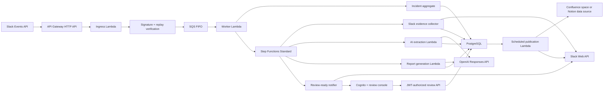

# OnRecord

**Put every incident on the record.**

OnRecord is an evidence-first incident review product that turns selected
production incident conversations from Slack into a record your team can trust.
It is deliberately not a one-prompt transcript summarizer:
incident facts, hypotheses, timeline events, and evidence references are
represented as separate domain concepts so later AI stages cannot silently turn
speculation into fact.

The current release establishes secure ingestion, collects an explicitly
selected set of public Slack channels, extracts an evidence-cited timeline, claims, and open
questions, and produces a versioned source-linked postmortem draft. An
authenticated, tenant-authorized console lets a human inspect evidence, create
immutable corrected revisions, browse every preserved version, acknowledge
contradictions and unknowns, and approve exactly one revision. Approval queues
durable publication to a configured Confluence space or private Notion data
source and a final Slack link.
GitHub retrieval remains a later increment.

## Implemented

- Authenticated Slack Events API endpoint with HMAC verification, constant-time
  comparison, and five-minute replay protection.
- `@app generate incident review: <title>` and equivalent RCA/postmortem command
  parsing for public channels.
- A signed Slack message shortcut and modal for a bounded time window, one
  primary public channel, up to four additional public channels, optional
  additional thread anchors, a reviewer, and an explicit retention
  acknowledgement.
- Immediate Slack acknowledgement followed by durable SQS FIFO handoff.
- API Gateway HTTP API and Lambda adapters which preserve the same application
  contracts as the local Fastify API and polling worker.
- Versioned queue contract with rapid-retry deduplication and Lambda partial
  batch failure handling for FIFO ordering.
- At-least-once worker with database-backed idempotency, optimistic locking, and
  deterministic Step Functions execution identity.
- Checkpointed Slack channel collection that automatically discovers thread
  roots inside the selected window, merges them with optional anchors, and
  expands replies in bounded 15-message pages. Provider-directed rate-limit
  waits are owned by Step Functions rather than a sleeping Lambda.
- Idempotent Slack evidence upserts with stable source IDs, SHA-256 content
  hashes, source permalinks, selected metadata, and configurable retention
  deadlines.
- A provider-neutral analysis use case and OpenAI Responses adapter using strict
  structured output, `store: false`, an explicit model, request/output budgets,
  timeouts, and no model tools.
- Durable analysis versions and database leases which suppress concurrent model
  calls, bound explicit retries, and make completed workflow invocations a
  no-op.
- Transactional persistence of model-generated timeline events, unreviewed
  claims, supporting/contradicting citations, open questions, model metadata,
  and token usage.
- Application validation which rejects fabricated evidence references,
  duplicate model keys, unsupported factual claims, and model attempts to mark
  content as human-confirmed.
- Evidence-constrained report generation from structured claims and timeline
  events rather than raw Slack text, with uncertainty preservation, URL/HTML
  rejection, contradiction coverage, and deterministic Markdown rendering.
- Versioned report drafts with expiring leases, bounded retries, transactional
  statement/source links, idempotent completion, and an explicit
  `NEEDS_REVIEW` terminal product state.
- A ten-incident synthetic evaluation corpus with deterministic offline safety
  metrics and an explicitly cost-gated live OpenAI evaluation mode.
- A separate least-privilege Slack notifier which posts only bounded counters
  and an authenticated deep link after the persisted draft is ready for review.
- Cognito authorization-code + PKCE authentication and PostgreSQL-backed active
  reviewer memberships; incident UUIDs are never treated as authorization.
- A bounded review API Lambda with strict request validation, tenant-scoped
  evidence reads, optimistic concurrency, idempotency keys, and safe errors.
- A private S3/CloudFront evidence-review console for inspecting source-linked
  claims, timeline events, and evidence and choosing keep, edit, or exclude for
  every generated statement.
- Immutable review revisions, deterministic reviewed Markdown, preserved
  provenance links, explicit contradiction/open-question acknowledgement, and
  atomic approval/audit/incident-state transitions.
- Tenant-authorized revision history which loads one bounded immutable version
  at a time and keeps historical content read-only.
- A transactional approval-to-publication outbox with PostgreSQL leases,
  bounded retries, provider-neutral page checkpoints, configurable Confluence
  or Notion publication, exact incident identity lookup, and an idempotent final
  Slack thread notification.
- Secrets Manager runtime loading with narrow, validated JSON secret contracts.
- Terraform for API Gateway, eight independently scaled Lambdas, encrypted SQS
  FIFO/DLQ, a checkpointed Standard workflow, least-privilege IAM, bounded
  logs, concurrency controls, Cognito, private S3/CloudFront hosting, and
  queue/workflow/review alarms.
- Incident aggregate with explicit, validated lifecycle transitions.
- PostgreSQL schema for tenants, installations, incidents, source artifacts,
  timeline events, claims, evidence links, workflow jobs, and audit events.
- Transactional, checksummed SQL migrations protected by an advisory lock.
- A shared required-migration startup gate for every database-backed Lambda.
- A build-once GitHub Actions release path with OIDC-only AWS authentication,
  serialized remote-state plans, migration-before-apply ordering, destructive
  change blocking, deterministic smoke checks, and opt-in staging/production
  promotion. AWS roles, state, and GitHub Environments must still be bootstrapped.
- Structured AI analysis contract that rejects references to unknown evidence.
- Redacted structured logging, health endpoints, graceful shutdown, CI, Docker,
  and reproducible local PostgreSQL/SQS services.

## Architecture



Production uses serverless protocol adapters; local development retains the
Fastify API and polling worker. Both paths compose the same application services
and domain rules from one modular codebase. This isolates Slack's short response
deadline from durable processing without duplicating business logic. See
[architecture](docs/architecture.md), [serverless deployment](infrastructure/terraform/README.md),
[deployment pipeline](docs/deployment-pipeline.md),
[deployment-role bootstrap](infrastructure/bootstrap/README.md),
[threat model](docs/threat-model.md), and [roadmap](docs/roadmap.md).

## Requirements

- Node.js 22+
- A `zip` command-line utility for Lambda packaging
- Docker with Compose
- A development Slack app for live Slack events

## Local setup

Install dependencies and start PostgreSQL plus LocalStack SQS:

```bash
npm install
docker compose up -d
cp .env.example .env
```

Load the environment, apply migrations, then start the API and worker in
separate terminals:

```bash
set -a
source .env
set +a
npm run db:migrate
npm run dev:api
```

```bash
set -a
source .env
set +a
npm run dev:worker
```

Configure the Slack app's Events API request URL as:

```text
https://<public-development-url>/integrations/slack/events
```

Subscribe to `app_mention`, grant the bot `app_mentions:read`, `chat:write`, and
`channels:history`, reinstall the app after changing scopes, invite it to a
public development channel, and send:

```text
@OnRecord generate incident review: Checkout outage
```

The production worker creates the incident idempotently, advances it to
`COLLECTING`, starts the durable workflow, and posts an idempotent acceptance
reply in the triggering Slack thread. The workflow retrieves that thread,
filters the product's operational status reply, stores canonical message
artifacts, and checkpoints progress after every page.

### Seed the synthetic Slack incident

For a repeatable demonstration, the repository includes a dry-run-first seeder
that creates a fictional two-responder cybersecurity outage across three public
Slack channels, including five threaded evidence anchors:

```bash
npm run demo:slack
npm run demo:slack -- --execute
```

It requires two distinct Slack user OAuth tokens from the same disposable demo
workspace. See the [Slack demo seeder guide](docs/slack-demo-seeder.md) for the
least-privilege app manifest, token setup, safeguards, rerun behavior, and exact
OnRecord scope.

## Engineering checks

```bash
npm run check
npm run eval:offline
```

The command runs formatting verification, ESLint with type-aware rules, strict
TypeScript checking, the test suite, the Node.js build, and a reproducible Lambda
ZIP build.

Live evaluation is deliberately billable and retrieves the OpenAI key directly
from AWS Secrets Manager through the active AWS identity. The secret must use
the existing strict JSON contract `{ "apiKey": "..." }`; do not export the key
itself:

```bash
export AWS_REGION=ap-southeast-2
export OPENAI_API_SECRET_ARN='arn:aws:secretsmanager:REGION:ACCOUNT:secret:NAME'
export OPENAI_MODEL='<approved model>'
EVAL_ALLOW_LIVE_PROVIDER=true npm run eval:live
```

The caller needs `secretsmanager:GetSecretValue` on that exact ARN and, for a
customer-managed secret key, scoped `kms:Decrypt`. Offline evaluation never
constructs an AWS client or reads a secret.

## AWS deployment foundation

Build the shared Lambda artifact:

```bash
npm run build:lambda
```

This produces the ignored artifact
`artifacts/incident-copilot-lambda.zip`, containing eight composition roots:
`slack-ingress-main.handler`, `incident-worker-main.handler`, and
`slack-evidence-collector-main.handler`, and
`incident-analysis-main.handler`, `incident-report-main.handler`, and
`incident-review-notification-main.handler`, plus
`incident-review-api-main.handler`, plus
`approved-report-publication-main.handler`. Build the static console separately
with `npm run build:web`. Terraform instructions, required
secret shapes, networking assumptions, cost controls, and deployment gates are in
[infrastructure/terraform/README.md](infrastructure/terraform/README.md).

The Terraform is not proof that this repository is already deployed. It also
does not provision PostgreSQL, the Slack app, or remote Terraform state. The
current hosted path uses an existing Supabase transaction pooler with its CA
certificate verified by each database-using Lambda. Those inputs and an OpenAI
API secret must exist before the AWS path can process a real incident. The
current Step Functions definition uses a bounded inline Map to collect up to
five explicitly selected Slack channels, generates an internal draft, and notifies Slack that human review
is required. Human statement revision, reviewed answers to open questions,
immutable history, approval, configurable Confluence/Notion publication, and
final Slack notification are implemented. Automatic source discovery is intentionally not implemented.

## Security posture

- Request bodies are authenticated before JSON parsing.
- Slack event payloads and source message text are never written to normal logs.
- Private channels and direct messages are rejected in the initial release.
- Queue delivery is assumed to be at-least-once; database uniqueness is the
  durable idempotency boundary.
- Tenant IDs are present in every persistent relationship and repository query.
- Model output can suggest claims but cannot grant access, approve content, or
  enqueue publication. Only an authenticated human approval can do so.

This is a foundation, not a completed security certification. The OAuth
installation flow, bot-token encryption, source ACL lookup, and destination ACL
checks must be completed before onboarding external workspaces.

## Project status

The next product increments are:

1. Add an incident-scoping flow for time windows and explicitly selected public
   channels, plus a source-coverage manifest.
2. Enforce retention expiry with a deletion processor and handle Slack
   revocation/uninstall events.
3. Integrate a GitHub App for deployments, commits, pull requests, and workflows.
4. Expand the labelled evaluation corpus and calibrate semantic quality with
   human review rather than treating structural coverage as accuracy.
5. Validate the authenticated review and configured publication experience with
   real reviewers and measure review time, edit distance, and delivery failures.

The project intentionally excludes Kubernetes, Kafka, a vector database, a graph
database, autonomous root-cause claims, private-channel ingestion, and automated
remediation until measured requirements justify them.
