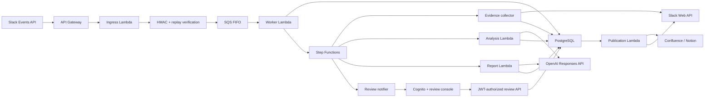

<div align="center">

# OnRecord

**Evidence-first incident review from Slack to an approved record.**

[Website](https://onrecord.kunal-sharma.in) ·
[Interactive demo](https://onrecord.kunal-sharma.in/review-demo/demo.html) ·
[2-minute walkthrough](https://onrecord.kunal-sharma.in/#walkthrough) ·
[System flow](https://onrecord.kunal-sharma.in/#architecture)

</div>

---

## Overview

OnRecord turns selected Slack incident conversations into a source-linked
postmortem that a human can verify, revise, approve, and publish.

It does not ask a model to summarize an entire transcript in one pass. Facts,
hypotheses, timeline events, contradictions, questions, and evidence references
remain separate domain concepts throughout the workflow.

### Why it exists

- Incident evidence is fragmented across channels and threads.
- Observations, guesses, and contradictions often look equally authoritative.
- Conventional summaries can turn correlation into confident causation.
- Reviewers need provenance and uncertainty, not only polished prose.

## Product flow

1. **Scope** — Select a time window, reviewer, primary channel, and up to four
   additional public Slack channels.
2. **Collect** — Discover thread roots, expand replies in bounded pages, and
   persist canonical evidence with coverage outcomes.
3. **Analyze** — Extract source-linked claims, timeline events,
   contradictions, classifications, and open questions.
4. **Draft** — Generate a report from validated structured evidence rather than
   raw Slack messages.
5. **Review** — Keep, edit, exclude, or add evidence-linked statements in an
   authenticated console.
6. **Approve** — Preserve an immutable revision and record the human decision.
7. **Publish** — Deliver the approved record to Confluence or Notion and post
   the final link to Slack.

## Implemented capabilities

| Area                | What is implemented                                                                                                                     |
| ------------------- | --------------------------------------------------------------------------------------------------------------------------------------- |
| Slack intake        | Signed Events API, message shortcut, incident-scoping modal, bounded channel selection, immediate acknowledgement                       |
| Durable processing  | SQS FIFO/DLQ, at-least-once worker, database idempotency, optimistic locking, Step Functions checkpoints                                |
| Evidence collection | Automatic thread discovery, bounded pagination, stable source IDs, SHA-256 hashes, permalinks, coverage and retention metadata          |
| AI analysis         | OpenAI Responses API, strict structured output, explicit model configuration, token/time budgets, `store: false`, no model tools        |
| Report generation   | Evidence-constrained claims and timeline input, source validation, uncertainty preservation, deterministic Markdown rendering           |
| Human review        | Cognito PKCE authentication, tenant authorization, evidence inspection, immutable revisions, contradiction and question acknowledgement |
| Publication         | Transactional outbox, leased retries, Confluence/Notion adapters, idempotent Slack completion notification                              |
| Operations          | Terraform, least-privilege IAM, Secrets Manager, CloudWatch logs and alarms, checked SQL migrations, GitHub Actions CI/CD               |

## Architecture



The synchronous Slack path ends after authentication and durable queue
acceptance. Collection, AI processing, review, and publication run
asynchronously with explicit retry and idempotency boundaries.

[Read the detailed architecture](docs/architecture.md)

## Technology

| Layer             | Technologies                                                                                                |
| ----------------- | ----------------------------------------------------------------------------------------------------------- |
| Application       | TypeScript, Node.js 22, Fastify, Zod, Pino                                                                  |
| AI                | OpenAI Responses API, strict JSON Schema outputs                                                            |
| Frontend          | React 19, TanStack Query, Radix UI, Tailwind CSS, Vite                                                      |
| Data              | PostgreSQL, transactional SQL migrations                                                                    |
| AWS               | API Gateway, Lambda, Step Functions, SQS, EventBridge, Cognito, Secrets Manager, CloudWatch, S3, CloudFront |
| Infrastructure    | Terraform, IAM, GitHub Actions OIDC                                                                         |
| Public website    | Next.js, React, S3, CloudFront                                                                              |
| Testing           | Vitest, React Testing Library, jsdom, Node.js test runner                                                   |
| Local development | Docker Compose, PostgreSQL, LocalStack                                                                      |

## Repository structure

```text
src/
  application/       Use cases, ports, review and report rules
  domain/            Incident lifecycle and invariants
  integrations/      Slack, OpenAI, Confluence and Notion adapters
  infrastructure/    PostgreSQL, queues, workflows and secrets
  lambda/            AWS Lambda composition roots
  web/               Authenticated review console
db/
  migrations/        Checksummed forward SQL migrations
  security/          Restricted database grants
infrastructure/
  terraform/         AWS infrastructure and deployment configuration
evals/
  fixtures/          Versioned synthetic evaluation cases
website/             Public product website and safe interactive demo
```

## Local development

### Requirements

- Node.js 22+
- npm
- Docker with Compose
- `zip`
- A disposable Slack development workspace for live Slack testing

### Start the application

```bash
npm install
docker compose up -d
cp .env.example .env
```

Load the environment and apply migrations:

```bash
set -a
source .env
set +a
npm run db:migrate
```

Run the API and worker in separate terminals:

```bash
npm run dev:api
```

```bash
npm run dev:worker
```

### Connect Slack

- Set the Events API URL to
  `https://<development-host>/integrations/slack/events`.
- Subscribe to `app_mention`.
- Grant `app_mentions:read`, `chat:write`, `channels:history`, and `users:read`.
  `users:read` resolves only incident authors for de-identification; the app
  does not request `users:read.email` or enumerate the directory.
- Reinstall the app after changing scopes.
- Invite the bot to a public test channel.

Trigger a review:

```text
@OnRecord generate incident review: Checkout outage
```

### Seed the synthetic incident

Preview the safe, fictional multi-channel Slack scenario:

```bash
npm run demo:slack
```

Create it in a disposable test workspace:

```bash
npm run demo:slack -- --execute
```

See the [Slack demo seeder guide](docs/slack-demo-seeder.md) for required
tokens, scopes, safeguards, and rerun behavior.

## Quality checks

```bash
npm run check
```

This runs:

- Prettier verification
- Type-aware ESLint
- Strict TypeScript checks
- Unit and integration tests
- Application and review-console builds
- Lambda packaging
- Release-manifest generation and verification

The repository also contains offline and live-provider evaluation runners. The
versioned offline fixtures currently require migration to the latest
open-question schema before their scores can be treated as valid.

## Deployment

### AWS application

```bash
npm run build:lambda
npm run build:web
```

Terraform deploys the API, eight Lambda entrypoints, workflow, queues,
authentication, review console, alarms, and IAM boundaries.

The deployment expects externally provisioned PostgreSQL, Slack configuration,
remote Terraform state, and validated Secrets Manager entries.

- [AWS deployment](infrastructure/terraform/README.md)
- [Deployment pipeline](docs/deployment-pipeline.md)
- [Deployment-role bootstrap](infrastructure/bootstrap/README.md)

### Public website

The product website is statically built and deployed to S3 through GitHub
Actions. CloudFront serves the custom domain and is invalidated after each
successful production deployment.

- [Website deployment](website/docs/s3-cloudfront-deployment.md)
- [Live website](https://onrecord.kunal-sharma.in)

## Security and reliability

- Authenticate Slack requests before parsing JSON.
- Verify HMAC signatures with constant-time comparison and replay protection.
- Reject private channels and direct messages in the current release.
- Treat queue delivery as at-least-once; PostgreSQL is the durable idempotency
  boundary.
- Scope persistent relationships and reviewer access by tenant.
- Load narrow secret contracts from Secrets Manager.
- Keep Slack evidence and secrets out of normal logs.
- Reject unknown evidence references and unsupported factual claims.
- Prevent models from approving, publishing, or marking content as
  human-confirmed.
- Require authenticated human approval before external publication.
- Preserve immutable revisions and source provenance.

This is not a security certification. External workspace onboarding still
requires Slack OAuth lifecycle management, destination ACL validation, and
enforced retention deletion.

[Read the threat model](docs/threat-model.md)

## Current limitations

- Slack OAuth installation and token lifecycle management are not implemented.
- GitHub evidence collection is roadmap work.
- Retention deadlines are stored, but an enforced deletion processor is not yet
  implemented.
- The evaluation corpus is synthetic and its recorded fixtures require a schema
  migration before scoring.
- No human-labelled semantic-quality baseline exists.
- Customer infrastructure and access policies still require explicit
  provisioning.

The project intentionally excludes Kubernetes, Kafka, vector and graph
databases, autonomous root-cause decisions, private-channel ingestion, and
automated remediation until measured requirements justify them.

## Documentation

| Document                                                   | Purpose                                                 |
| ---------------------------------------------------------- | ------------------------------------------------------- |
| [Architecture](docs/architecture.md)                       | Components, boundaries, data model and failure handling |
| [Threat model](docs/threat-model.md)                       | Security assumptions, controls and residual risks       |
| [Roadmap](docs/roadmap.md)                                 | Planned product and platform increments                 |
| [Slack demo seeder](docs/slack-demo-seeder.md)             | Safe synthetic workspace setup                          |
| [Terraform deployment](infrastructure/terraform/README.md) | AWS resources, inputs and operational constraints       |
| [CI/CD pipeline](docs/deployment-pipeline.md)              | Build-once deployment and promotion model               |
