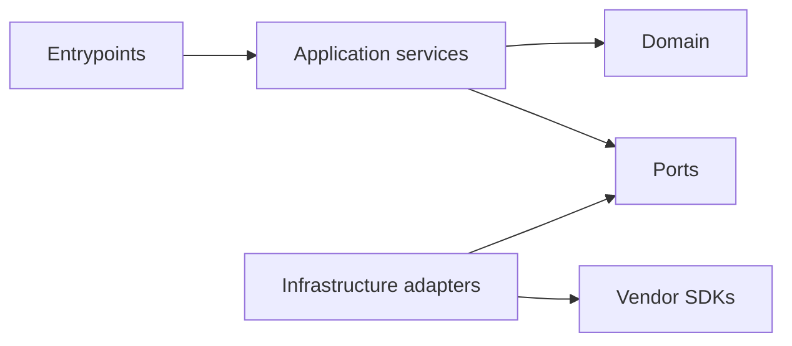

# ADR 0001: Use a modular monolith with separate API and worker entrypoints

- Status: accepted
- Date: 2026-07-17
- Decision owners: project maintainers

## Context

The product must accept signed Slack events quickly, execute variable-duration integration and AI work asynchronously, and preserve enough structure to grow into evidence collection, review, and publication workflows.

The domain is still being discovered. Claim classifications, permission rules, data retention, source connectors, and reviewer behavior will change as the project is tested on real incidents. At the same time, webhook ingestion and background work have different latency, scaling, and failure characteristics.

The architecture therefore needs:

- a strict synchronous ingress budget;
- durable asynchronous handoff;
- independently scalable API and worker processes;
- transactional consistency for job, evidence, and review state;
- testable dependency boundaries around Slack, AWS, PostgreSQL, and model providers;
- low operational overhead for a small project team; and
- a credible path to extract services only when measurements justify it.

## Decision

Use a strict TypeScript single-package modular monolith in one repository and release artifact, with separate Fastify API and SQS worker entrypoints.

The API and worker share modules inside one npm package but run as independent processes:

```text
Slack -> API entrypoint -> SQS FIFO -> worker entrypoint -> PostgreSQL
```

External systems are reached through explicit ports implemented by adapters. Domain modules do not import Slack, AWS, database, web-framework, or model SDKs.

### Logical modules

The initial logical boundaries are:

- **ingress:** Slack request authentication, raw-body handling, event normalisation, channel policy;
- **jobs:** idempotency identity, state machine, attempts, retry classification;
- **queue:** versioned command contract and producer/consumer ports;
- **incidents:** future incident scope and lifecycle;
- **evidence:** future source references, snapshots, permissions, and retention;
- **claims:** future claims, support links, contradictions, and human decisions;
- **ai:** provider-neutral extraction and generation interfaces;
- **publication:** future reviewed external effects;
- **audit:** content-free security and business action records; and
- **observability:** safe metrics, traces, and allowlisted logs.

These are code-ownership and dependency boundaries, not separately deployed services.

### Dependency rules



1. Domain modules are pure TypeScript and own invariants.
2. Application services orchestrate use cases and depend on interfaces.
3. Adapter modules translate protocols, SDK objects, and external errors.
4. Entrypoints compose dependencies and manage process lifecycle.
5. A domain module cannot import an adapter or entrypoint.
6. An adapter cannot bypass an application service to implement domain policy.
7. Cross-module reads and writes use an explicit application interface.
8. Shared code is limited to stable primitives; a `common` package must not become a boundary bypass.

### Process topology

The API process:

- is publicly reachable behind the approved edge;
- verifies Slack requests and enqueues work;
- has queue-send permission;
- does not have queue-receive permission;
- has no need for model-provider credentials; and
- is scaled for request latency.

The worker process:

- has no public ingress;
- receives queue messages;
- owns long-running orchestration;
- has database and approved connector access;
- eventually has narrowly scoped model-provider access; and
- is scaled by queue age and downstream limits.

The processes use the same build output and may use the same container image with different commands. This reduces build variance while allowing independent rollout and capacity.

### Persistence

PostgreSQL is the system of record. It provides transactions, uniqueness constraints, optimistic state-transition safety, tenant-keyed composite foreign keys, and future support for relational review workflows. SQS is a delivery mechanism, not the authoritative job state.

The initial SQL migration defines tenants, encrypted Slack-installation metadata, incidents, source artifacts, timeline events, claims, claim-evidence links, workflow jobs, and audit events. Only the incident repository is active in the current worker flow; having a table does not mean its collector or product workflow is implemented.

Migrations are immutable release artifacts. A PostgreSQL advisory lock serialises concurrent migrators, each migration runs transactionally, and recorded checksums turn historical edits or missing migrations into explicit integrity failures.

When external side effects are introduced, an outbox pattern will atomically record the intended effect with its domain transition. Each destination operation will have a stable idempotency key.

## Consequences

### Positive

- The API can acknowledge Slack without waiting for database-heavy, network-heavy, or AI work.
- API and worker failures and scaling are isolated at the process level.
- Domain changes remain atomic and easy to refactor while the product model is immature.
- One language and repository reduce cognitive and CI/CD overhead.
- In-process module calls are observable and easier to test than an early distributed call graph.
- Vendor-neutral ports make integrations replaceable without pretending vendors have identical semantics.
- PostgreSQL transactions can protect idempotency and review invariants without distributed transactions.

### Negative

- Module isolation is enforced by code review and architecture tests rather than a network boundary.
- A careless shared utility or direct table access can create hidden coupling.
- API and worker releases are normally versioned together, so queue schema compatibility must be managed during rolling deployments.
- A single repository can accumulate slow CI unless tests and ownership remain structured.
- One database can become a contention or blast-radius boundary at higher scale.
- TypeScript is suitable for the integration-heavy workload but may not be the best implementation language for every future ML or data-processing task.

### Neutral but important

- “Monolith” does not mean one process, one module, synchronous work, or no queues.
- “Separate entrypoints” do not imply independently owned microservices.
- SQS FIFO reduces duplicate delivery within a broker window but does not provide business exactly-once semantics.
- Provider-neutral interfaces do not make provider behavior interchangeable; adapters must preserve semantic differences.

## Alternatives considered

### Microservices per connector or domain

Rejected for the foundation.

Advantages:

- hard deployment and IAM boundaries;
- independent scaling and ownership;
- smaller failure domains when designed well.

Why not now:

- domain ownership is not stable;
- distributed tracing, versioned APIs, deployment coordination, and eventual-consistency handling would dominate product learning;
- evidence, claims, review, and publication need transactional invariants that are simpler in one database; and
- a small team would own too many operational surfaces.

Microservices would make the diagram more elaborate, not the current product more reliable.

### One synchronous web application

Rejected.

Advantages:

- minimal infrastructure;
- straightforward local debugging.

Why not:

- Slack acknowledgement deadlines are incompatible with collection and model latency;
- retries would be tied to HTTP request lifetime;
- burst absorption and backpressure would be poor; and
- API availability would depend directly on every source and model provider.

### Independent serverless function for every step

Rejected for the foundation.

Advantages:

- scale to zero;
- event-native deployment;
- fine-grained IAM.

Why not:

- function fan-out can obscure workflow and error ownership;
- local testing and tracing across steps become harder;
- timeout and payload limits constrain later evidence processing;
- shared domain rules tend to drift across handlers; and
- the expected workload does not justify the operational shape yet.

Lambda may still be appropriate for a narrow adapter or scheduled maintenance task later.

### Workflow engine from day one

Rejected for the foundation, reconsider after multi-stage collection exists.

Advantages:

- durable timers, retries, checkpoints, and human-wait states;
- clear long-running workflow history.

Why not now:

- the current foundation has one durable handoff and a small state machine;
- introducing Temporal or Step Functions before the workflow exists creates concepts and infrastructure with no measured benefit.

### Kafka as the event backbone

Rejected.

Advantages:

- high-throughput ordered logs;
- replay and multiple independent consumers.

Why not now:

- incident triggers are low-volume, bursty commands rather than a high-throughput event stream;
- SQS provides adequate durability and backpressure with far less operational overhead; and
- replaying restricted source content introduces additional retention risk.

### Separate databases per module

Rejected for now.

Advantages:

- stronger ownership and blast-radius separation.

Why not now:

- complicates job/evidence/review consistency;
- requires distributed workflow and reconciliation before scale demands it; and
- increases backup, migration, and observability surfaces.

Logical ownership within PostgreSQL is sufficient initially.

## Compatibility and evolution rules

- Queue messages have an explicit schema version.
- Consumers must tolerate a rolling deployment where old and new producers coexist.
- Additive fields are optional until every producer supplies them.
- A breaking queue change uses a new version and a deliberate migration or parallel consumer.
- Database migrations are backwards compatible across the deployment window.
- Model response schemas are versioned independently of queue and database schemas.
- External adapter errors are translated into stable application error categories.

## When to revisit this decision

Reconsider extraction of a service only when at least one condition is measured:

- a module requires an independent security or data-residency boundary;
- its load profile cannot be handled by independently scaling the API or worker process;
- database contention cannot be resolved with indexing, partitioning, or workload isolation;
- a separate team owns the module and release coordination is a sustained bottleneck;
- a connector's availability or dependency graph creates unacceptable blast radius;
- the module requires a runtime that TypeScript cannot meet economically; or
- compliance requires physically separate storage or processing.

Before extraction, record:

- the measured constraint;
- the API and consistency contract;
- failure and retry semantics;
- data ownership and migration plan;
- operational owner and service-level objective; and
- why a separate process or database within the monolith is insufficient.

## Enforcement

The decision is only useful if enforced. Planned architecture checks include:

- import rules preventing domain-to-adapter dependencies;
- unit tests for pure domain policies;
- contract tests shared by production and test adapters;
- queue compatibility tests;
- migration tests;
- code ownership or review requirements for module boundaries; and
- architecture review for any new runtime, datastore, or direct cross-module table access.
