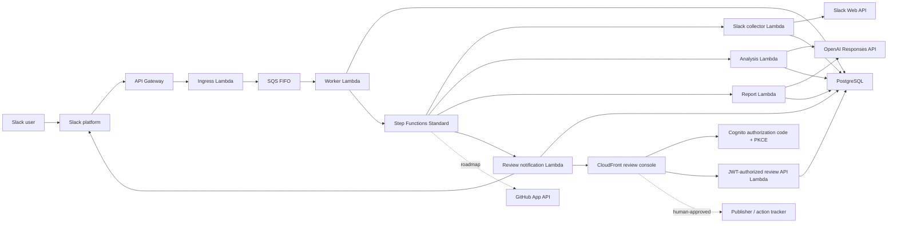
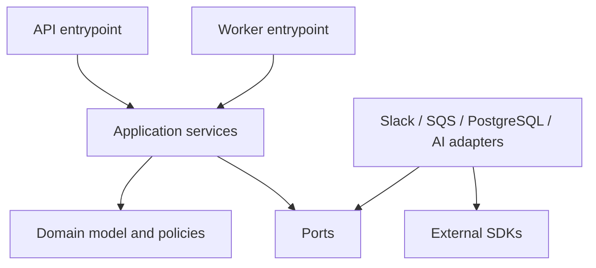
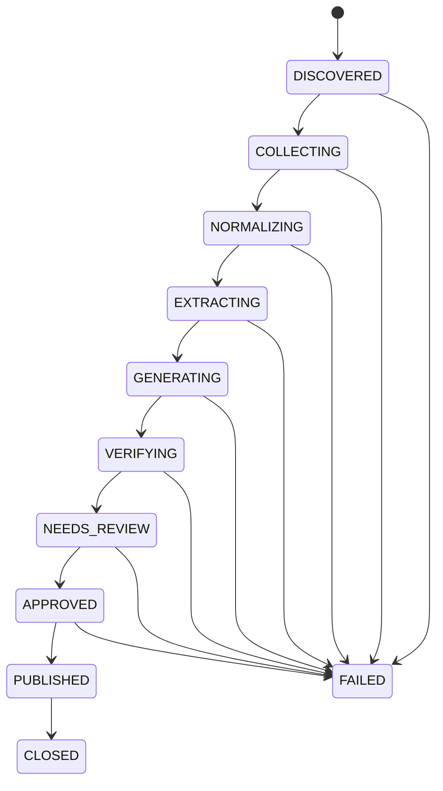

# Incident Evidence Copilot architecture

Status: triggering-thread collection, structured AI extraction, review-ready draft generation, and human revision/approval implemented
Last updated: 2026-07-18

## Purpose

Incident Evidence Copilot turns an explicitly triggered Slack incident conversation into a durable, reviewable incident-processing job. The product will eventually combine Slack and operational evidence, extract structured claims, and prepare a source-linked postmortem for human approval.

The implementation deliberately builds each generative step on durable evidence and
reliability boundaries:

1. authenticate the caller;
2. accept the event quickly;
3. enqueue one durable unit of work;
4. process it idempotently;
5. persist an auditable state transition;
6. extract and render only source-linked incident statements;
7. stop at a human-review boundary; and
8. keep source content out of operational logs.

This document describes both the implemented foundation and the intended product architecture. A component marked **roadmap** is not part of the current security or reliability claim.

## Product boundary

The service is an incident-reconstruction overlay. It is not an incident-management platform.

In scope:

- a user-triggered Slack workflow;
- permission-aware evidence collection;
- durable asynchronous processing;
- structured, evidence-linked claims and timelines;
- provider-neutral AI integration;
- a human review gate before publication; and
- follow-up action creation after approval.

Explicitly out of scope:

- paging, on-call scheduling, or status-page management;
- autonomous diagnosis or remediation;
- unrestricted workspace search;
- direct-message ingestion;
- automated publication of model output;
- a general-purpose document editor; and
- a general enterprise-search index.

## What is implemented and what is not

“Implemented” means the foundation contains the corresponding code boundary and testable behavior. It does not mean that a production AWS account, Slack workspace, or model-provider account has been provisioned.

### Implemented foundation

- A strict TypeScript single-package modular monolith with local Fastify/polling
  entrypoints and production API Gateway/Lambda adapters.
- A Slack ingress boundary that verifies signed requests before accepting work.
- Replay protection based on Slack's signed request timestamp.
- Parsing for Slack URL-verification requests and `app_mention` incident-review commands.
- An initial fail-closed Slack-ID guard that accepts `C`-prefixed channel IDs only, ignores `G`/`D`/unknown prefixes, and ignores unrelated event types.
- A Zod-validated, versioned `incident.review.requested` queue contract.
- SQS FIFO producer and consumer adapters with explicit at-least-once delivery semantics.
- An API Gateway payload-v2 Lambda adapter that verifies Slack's signature over
  reconstructed raw or base64-decoded bytes before parsing.
- An SQS Lambda adapter that validates every record, reports partial batch
  failures, and stops after the first FIFO failure.
- An idempotent worker application service backed by PostgreSQL uniqueness and optimistic concurrency.
- A Step Functions Standard adapter with deterministic incident-scoped execution
  names; duplicate execution starts are the only orchestration error treated as
  success.
- Runtime retrieval of Slack and database credentials from Secrets Manager using
  strict, content-safe secret contracts.
- An `IncidentAggregate` with explicit lifecycle states and controlled transitions.
- Tenant-keyed PostgreSQL schemas for installations, incidents, source artifacts, timeline events, claims, evidence links, workflow jobs, and audits, with composite foreign keys preventing cross-tenant associations.
- An incident repository whose every query carries tenant scope, plus checksum-verified, advisory-lock-protected SQL migrations.
- A vendor-neutral, Zod-validated incident-analysis contract; no model SDK is coupled to domain logic.
- A production OpenAI Responses adapter with strict structured output,
  `store: false`, no tools, bounded request/response budgets, and a fixed
  provider endpoint.
- A deterministic evidence manifest plus durable, versioned analysis leases
  which prevent concurrent model calls for one incident analysis version.
- Transactional persistence of timeline events, all citations, unreviewed
  claims, supporting/contradicting links, open questions, provider metadata, and
  token usage.
- A second versioned OpenAI contract which produces evidence-constrained report
  sections from persisted claims, timeline events, and open questions rather
  than raw Slack content.
- Application validation that rejects fabricated source IDs, missing disputed
  claims, causal overstatement, URLs, HTML, and secret-like output before a
  report can be persisted.
- Deterministic Markdown rendering, transactional storage of report sections,
  statements, source links, manifest identity, model metadata, and token usage,
  followed by an explicit `NEEDS_REVIEW` lifecycle state.
- A content-free, retry-safe Slack notification when a draft is ready for human
  review. Notification failure does not discard or regenerate a completed draft.
- A Cognito-authenticated review console and JWT-authorized API whose PostgreSQL
  read model checks active tenant membership on every incident access.
- Immutable source-linked human revisions and a transactionally locked approval
  transition with idempotency, optimistic concurrency, and content-free audits.
- A deterministic offline evaluation harness with ten versioned synthetic
  fixtures and explicit structural, contradiction, ordering, source-coverage,
  overstatement, and leakage checks. These checks do not claim semantic truth.
- Zod-validated, process-specific environment configuration.
- Liveness and readiness endpoints.
- Structured Pino logging with request logging disabled and sensitive-field redaction.
- Docker/local Compose, CI, deterministic Lambda packaging, and unit-test foundations.
- Terraform for API Gateway HTTP API, Lambda ingress and worker functions, SQS
  FIFO/DLQ, the Slack evidence collector Lambda, a checkpointed Standard state
  machine, the review API, Cognito, private S3/CloudFront console hosting,
  least-privilege IAM, log retention, concurrency limits, and queue/workflow/API
  health alarms.
- Bounded retrieval of the triggering public Slack thread, stable source
  permalinks, canonical artifact identities, retention deadlines, durable page
  checkpoints, and explicit Slack rate-limit waits.
- Dependency direction that keeps domain logic independent of Fastify, Slack, AWS, PostgreSQL, and model vendors.

### Deliberately not implemented yet

- Slack OAuth installation and token lifecycle management.
- Explicitly selected Slack channel-history collection beyond the triggering
  thread.
- GitHub App evidence collection.
- A human-labelled semantic evaluation corpus, provider quality baselines, and
  a quality/cost dashboard.
- Semantic evidence comparison beyond explicit model-supplied contradictions.
- Action-item creation.
- Private-channel or direct-message processing.
- Automatic source discovery.
- A provisioned AWS account or completed deployment.
- RDS/RDS Proxy, VPC/subnets/endpoints or NAT, database backups, and remote
  Terraform state.

The roadmap is tracked in [roadmap.md](./roadmap.md). Threats that become relevant as these capabilities are introduced are tracked in [threat-model.md](./threat-model.md).

## Architecture principles

### Evidence precedes prose

The system must first create an evidence record and a structured claim graph. Generated prose is a view over those structures. A writing model must not introduce incident-specific facts that are absent from the reviewed claim graph.

### Source data is untrusted

Slack messages, pasted logs, file contents, link titles, GitHub comments, and model output are data. None are instructions to the runtime. They must not be allowed to select tools, alter permissions, publish documents, or execute code.

### Acknowledgement is separate from processing

Slack should receive a successful acknowledgement after authentication and durable queue acceptance, not after evidence collection or AI generation. The synchronous API path has a small, predictable latency budget; all variable work belongs in the worker.

### At-least-once delivery is normal

Neither Slack retries nor queue delivery provide exactly-once execution. Correctness comes from stable identifiers, database uniqueness constraints, and transactional state transitions—not from assuming a message is delivered once.

### Permissions can only narrow

A derived artifact must never disclose evidence to an audience broader than the
evidence's permitted audience. The current single-workspace path accepts public
Slack channels and publishes only a human-approved immutable revision into one
operator-configured Confluence space or Notion data source. It does not yet calculate destination
readers or compare ACLs, so external multi-tenant production remains blocked
until that policy is enforceable.

### Model providers are replaceable infrastructure

Domain types describe extraction and generation requests. Provider adapters translate those requests to a selected model API. Prompts, response schemas, retry policy, and model metadata are recorded independently of a provider SDK.

### Observability excludes payloads

Logs and trace attributes may include correlation IDs, hashed stable identifiers, state, duration, sizes, and error classifications. They must not contain message text, OAuth tokens, signatures, queue bodies, model prompts, model responses, or generated documents.

## System context



Solid lines are the foundation execution path. Dashed lines are planned integrations.

## Foundation request flow

```mermaid
sequenceDiagram
    autonumber
    participant Slack
    participant Gateway as API Gateway
    participant API as Ingress Lambda
    participant FIFO as SQS FIFO
    participant Worker as Worker Lambda
    participant DB as PostgreSQL
    participant SFN as Step Functions
    participant Collector as Collector Lambda
    participant WebAPI as Slack Web API
    participant Analysis as Analysis Lambda
    participant Report as Report Lambda
    participant Notify as Notification Lambda
    participant Model as OpenAI Responses API

    Slack->>Gateway: Raw signed HTTP request
    Gateway->>API: Payload v2 body + base64 flag
    API->>API: Verify timestamp and HMAC over raw body
    API->>API: Parse and apply initial C-prefix channel guard
    API->>FIFO: Enqueue typed job with stable deduplication ID
    FIFO-->>API: Durable acceptance
    API-->>Slack: HTTP 2xx

    FIFO->>Worker: Deliver job (possibly more than once)
    Worker->>DB: Acquire idempotency key / create job
    alt first valid attempt
        Worker->>DB: Transition incident to COLLECTING
        Worker->>SFN: Start deterministic incident execution
        SFN-->>Worker: Started or already exists
        loop One bounded page until complete
            SFN->>Collector: tenant + incident + job IDs
            Collector->>WebAPI: conversations.replies (limit 15)
            Collector->>WebAPI: chat.getPermalink
            Collector->>DB: Upsert artifacts + advance cursor atomically
            Collector-->>SFN: status + counts only
        end
        SFN->>Analysis: tenant + incident + job IDs
        Analysis->>DB: Load bounded evidence + acquire versioned lease
        Analysis->>Model: Strict structured extraction, no tools
        Model-->>Analysis: Timeline + claims + citations + questions
        Analysis->>DB: Atomically persist output, usage, and completion
        Analysis-->>SFN: status + IDs + counts only
        SFN->>Report: tenant + incident + analysis IDs/counts
        Report->>DB: Load structured evidence + acquire versioned lease
        Report->>Model: Strict source-linked report contract, no tools
        Model-->>Report: Sections + statements + source IDs
        Report->>Report: Validate provenance and classification strength
        Report->>DB: Atomically persist draft, links, usage, and Markdown
        Report->>DB: Transition GENERATING -> VERIFYING -> NEEDS_REVIEW
        Report-->>SFN: status + draft ID + counts only
        SFN->>Notify: tenant + incident + draft ID/counts
        Notify->>DB: Authorize workspace incident and ready state
        Notify->>Slack: Content-free review-ready thread reply
        Notify-->>SFN: notification outcome; no report content
        Worker-->>FIFO: Report success
    else duplicate or terminal job
        Worker->>DB: Read existing outcome
        Worker->>SFN: Start same deterministic execution
        Worker-->>FIFO: Report success without repeating workflow
    else retryable failure
        Worker--xFIFO: Report record plus unprocessed FIFO records as failures
    end
```

The API must preserve the exact raw request bytes for signature verification. Parsing or re-serialising JSON before verification changes the signed bytes and invalidates the security boundary.

## Runtime components

### Ingress entrypoints

Responsibilities:

- expose Fastify health/Slack routes locally or the Slack route through API
  Gateway HTTP API in AWS;
- capture the raw HTTP body;
- validate Slack's versioned HMAC signature with constant-time comparison;
- reject timestamps outside the replay window;
- handle Slack URL-verification challenges without queueing work;
- recognise explicit `app_mention` commands while acknowledging unrelated Slack events;
- validate the minimal event envelope;
- enforce the initial `C`-prefixed channel guard;
- create a content-free correlation context;
- enqueue a typed message; and
- return a small response.

It must not:

- call a model;
- retrieve channel history;
- publish a document;
- perform long database workflows; or
- log the raw request, headers, or queue body.

### FIFO queue

SQS FIFO is the load-leveling and durability boundary between ingress and processing.

The queue message should be versioned and contain only fields required by the consumer. A representative envelope is:

```ts
interface IncidentReviewRequestedV1 {
  type: 'incident.review.requested';
  version: 1;
  jobId: string;
  tenantId: string;
  requestedAt: string;
  requestedTitle: string;
  source: {
    provider: 'slack';
    eventId: string;
    workspaceId: string;
    channelId: string;
    messageTs: string;
    threadTs?: string;
    userId: string;
  };
}
```

The contract is strict and Zod validated at the consumer boundary. `source.eventId` plus workspace is the business idempotency identity. `jobId` identifies an individual accepted command; it must not be the only duplicate-suppression key because Slack retries may cause ingress to generate another job ID.

Queue policy:

- use a stable deduplication ID derived from workspace and event ID;
- use a message group that preserves the smallest ordering scope the workflow requires;
- configure a dead-letter queue and bounded receive count;
- set visibility timeout above the expected worker lease and extend it for long work;
- enable server-side queue encryption; use a customer-managed KMS key when the
  organisation's key-control requirements justify it;
- restrict send permission to the API role and receive/delete permission to the worker role; and
- never place OAuth credentials or Slack signing secrets in a message.

FIFO deduplication reduces duplicate deliveries within its broker window; it does not replace database idempotency.

### Worker entrypoint

Responsibilities:

- validate the queue schema and supported version;
- reject tenant/workspace mismatches before database processing;
- create or recover the incident using the business idempotency key;
- advance it through an allowed transition to `COLLECTING`;
- request the same deterministic Step Functions execution for both new and
  duplicate deliveries;
- report success only after the database and workflow-start boundaries succeed;
  and
- on a FIFO failure, report the failed and all unprocessed records for
  redelivery.

The triggering-thread collector, analysis, report, and notification stages separate provider
throttling, retryable dependency failures, and terminal safe failures. Roadmap
responsibilities include selected-channel collection, reviewer authorization,
approval, and publication. Those steps must also be checkpointed so a retry
does not repeat completed external side effects.

### PostgreSQL

PostgreSQL is the initial system of record for tenant configuration, incident jobs, evidence metadata, claims, review decisions, and publications.

The foundation requires at least:

- a unique constraint over the stable event identity;
- an explicit job state, version, attempt count, and timestamps;
- atomic job acquisition or transition;
- safe error codes rather than raw exception or payload storage; and
- migrations reviewed with the application change that consumes them.

The implemented migration runner serialises concurrent migrators with a database advisory lock, runs each migration transactionally, and records a SHA-256 checksum. Editing, renaming, or removing an already applied migration is therefore an integrity failure rather than silent schema drift.

Collected Slack text is stored only in the restricted `source_artifacts`
record, with a content hash and retention deadline. It is never placed in the
workflow state or a generic job JSON column. The current release records expiry
but does not yet delete expired content; the deletion processor remains required
before claiming an enforced retention policy.

Structured report drafts are stored separately from extraction runs. A report
version has one immutable input-manifest hash, one durable lease, bounded
attempts, source-linked statements, and deterministic Markdown. The database
does not treat a model response as complete until all sections, statements,
claim/timeline links, usage, and final status commit in one transaction.

### AI gateway

The implemented analysis and report OpenAI adapters sit behind provider-neutral
interfaces and own:

- model selection;
- schema-constrained request and response translation;
- timeouts and retry budgets;
- prompt and schema versioning;
- usage metadata;
- sensitive-data policy; and
- provider-specific error normalisation.

It uses a fixed Responses API endpoint, sends no tools, disables provider-side
response storage for the request, and validates the returned structure and every
evidence reference in the application. The gateway does not own claim truth,
permissions, or publication decisions. Its output remains untrusted until human
review. Provider contractual retention/training behavior must still be reviewed;
`store: false` is not a complete data-governance policy. The report adapter sees
the already structured incident record, not the raw Slack transcript, reducing
but not eliminating disclosure and prompt-injection risk.

## Module boundaries and dependency direction

The modular monolith uses ports and adapters within one npm package and deployable codebase:



Dependency rules:

1. Domain modules import no framework, cloud, Slack, database, or model SDK.
2. Application services depend on domain modules and interfaces.
3. Adapters implement interfaces and translate external errors into application error types.
4. Entrypoints perform composition and lifecycle management; they do not contain business rules.
5. Cross-module writes pass through an application service rather than reaching into another module's tables.
6. Network and time are injected dependencies in tests.

The rationale is recorded in [ADR 0001](./adr/0001-modular-monolith.md).

## Incident state model

The implemented `IncidentAggregate` owns the end-to-end lifecycle vocabulary.
The worker advances to `COLLECTING`; analysis advances through `NORMALIZING` and
`EXTRACTING`, report generation owns `GENERATING` and `VERIFYING`, and a valid
persisted draft stops at `NEEDS_REVIEW`:



`CLOSED` and `FAILED` are terminal. `PUBLISHED` can transition only to `CLOSED`. The aggregate returns immutable snapshots, increments an optimistic version on each transition, and rejects every transition not present in the state table.

Rules:

- later phases must not bypass the aggregate by directly updating a status column;
- a duplicate source event reuses the existing incident rather than creating a second one;
- persistence uses the expected version to reject stale concurrent writes;
- state changes and associated outbox records should share one database transaction when external effects are introduced;
- a worker crash may cause SQS redelivery, but the uniqueness key and optimistic version make reprocessing safe; and
- error records contain classifications and correlation IDs, not raw source material.

## Data model and classification

### Foundation records and schemas

| Record              | Purpose                                                                   | Sensitive fields                                        | Current status                                         |
| ------------------- | ------------------------------------------------------------------------- | ------------------------------------------------------- | ------------------------------------------------------ |
| Tenant              | Isolation root and lifecycle                                              | organisation identity                                   | schema implemented                                     |
| Slack installation  | Workspace grant and encrypted bot-token metadata                          | token ciphertext, scopes, installing user               | schema implemented; OAuth flow is roadmap              |
| Incident            | Stable idempotency, tenant/source identity, lifecycle, optimistic version | Slack identifiers and requested title                   | schema and repository implemented                      |
| Source artifact     | Tenant-safe source metadata and optional snapshot                         | restricted Slack content                                | triggering-thread collection implemented               |
| Slack collection    | Durable page cursor, counts, state, and safe failure code                 | Slack source identifiers                                | schema and repository implemented                      |
| Analysis run        | Immutable manifest, lease, attempts, model/usage, and outcome             | provider request metadata                               | schema and repository implemented                      |
| Timeline event      | Normalised event/report time, classification, and citations               | generated incident detail                               | structured model extraction implemented                |
| Claim               | Structured incident statement, classification, and review state           | generated or human-authored incident detail             | model generation implemented; review roadmap           |
| Claim-evidence link | Support, contradiction, or context relation                               | relationship rationale                                  | supporting/contradicting population implemented        |
| Open question       | Material uncertainty the evidence does not resolve                        | generated incident detail                               | structured model extraction implemented                |
| Report draft        | Versioned generation lease, manifest, model usage, and rendered Markdown  | generated incident narrative                            | generation and `NEEDS_REVIEW` gate implemented         |
| Report section      | Ordered fixed report structure                                            | generated incident narrative                            | transactional persistence implemented                  |
| Report statement    | Typed claim/timeline statement with classification                        | generated incident narrative                            | source validation and persistence implemented          |
| Report source link  | Claim or timeline provenance for one report statement                     | evidence relationship                                   | composite tenant-safe links implemented                |
| Workflow job        | Durable attempt, lock, retry, and result metadata                         | payload/result fields must follow restricted-data rules | schema implemented; current SQS path keys on incidents |
| Audit event         | Append-oriented security/business event                                   | actor and target metadata                               | schema implemented; complete audit emission is roadmap |

The schema uses `(tenant_id, incident_id, ...)` composite foreign keys so evidence, timeline events, claims, and links cannot be associated across tenants even if application code supplies mismatched IDs. The repository also includes `tenant_id` in every incident read and write. Row-level security remains a later defence-in-depth requirement for multi-tenant production.

### Planned records and runtime behavior

| Record         | Purpose                            | Important invariant                     |
| -------------- | ---------------------------------- | --------------------------------------- |
| Human decision | Approval, rejection, or correction | model cannot create it                  |
| Publication    | External artifact metadata         | audience policy checked before creation |

Data classification:

- **Secret:** Slack signing secret, OAuth access/refresh tokens, model-provider keys, database credentials.
- **Restricted:** message content, generated drafts, file content, incident evidence, model prompts/responses.
- **Confidential metadata:** workspace, channel, user, repository, incident, and permalink identifiers.
- **Operational metadata:** internal job IDs, durations, version numbers, counts, and enumerated error classes.

Only operational metadata is allowed in standard logs. Identifiers should be hashed or omitted where they are not necessary for diagnosis.

## Trust boundaries

1. **Internet to API:** untrusted bytes become authenticated Slack input only after signature and replay validation.
2. **API to queue:** authenticated input becomes an internal versioned command; IAM and queue encryption protect transport and storage.
3. **Queue to worker:** messages remain untrusted because producers or stored messages may be compromised; schema and tenant validation run again.
4. **Worker to database:** parameterised repository methods and tenant-scoped access protect durable state.
5. **Collector to Slack:** a workspace-bound bot grant authorizes retrieval;
   each artifact retains its canonical source identity and permalink. The
   current single-workspace secret is not a replacement for a production OAuth
   installation lifecycle.
6. **Analysis Lambda to model provider:** restricted triggering-thread data
   leaves the product boundary using a dedicated secret and fixed endpoint. A
   production tenant/provider policy and data-processing review remain required.
7. **Report Lambda to model provider:** restricted structured claims, timeline,
   and questions leave the product boundary; raw transcript content is not sent
   by this stage. Every returned source ID is checked against the immutable
   manifest before persistence.
8. **Notification Lambda to Slack:** a workspace-bound token may send only a
   fixed, content-free readiness message to the incident's original thread.
9. **Review to publication:** approval commits a publication outbox record in
   the same transaction. A scheduled, leased worker creates or reconciles the
   page using the configured Confluence or Notion adapter, checkpoints its
   provider, external ID, and URL, and then posts the link to the incident's
   original Slack thread. Provider assignment is durable after the first
   attempt so a configuration switch cannot silently duplicate an ambiguous
   external side effect in another system. Confluence scoped-token requests use
   the fixed `api.atlassian.com/ex/confluence/{cloudId}` gateway, while returned
   page links are resolved only against the separately configured site origin.

## Idempotency and consistency

Stable identity should be derived from immutable source identifiers, for example:

```text
slack-event:{workspace_id}:{event_id}
```

The database uniqueness constraint is authoritative. The implementation should insert-or-read atomically and must not use a check-then-insert sequence.

AI extraction uses a unique `(tenant, incident, analysis_version)` run plus an
immutable manifest hash. An expiring database lease suppresses concurrent model
calls, and a completed run returns its stored counters without calling the
provider again. The OpenAI client request ID is diagnostic correlation only; it
is not treated as an idempotency guarantee.

There is no distributed transaction between a model provider and PostgreSQL. A
network failure with an unknown provider outcome is therefore terminal rather
than blindly retried. A rarer failure after a successful model response but
before the database transaction commits may cause a second billable request
after lease expiry. Avoiding that residual cost ambiguity would require a
provider-supported idempotency/retrieval contract or durable encrypted response
staging, neither of which this slice claims.

Report generation uses the same pattern with a unique
`(tenant, incident, report_version)` run and immutable structured-evidence
manifest. A completed version is a no-op. Slack notification uses the persisted
draft ID as its stable client message ID. A terminal notification failure leaves
the draft in `NEEDS_REVIEW`; it must never trigger a second report generation.

Approved-report publication applies these controls; future issue-creation
effects must do the same:

- use an outbox record committed with the domain state;
- give each publication or issue creation a stable idempotency key;
- persist the external resource ID before acknowledging completion;
- reconcile ambiguous timeouts instead of blindly retrying; and
- distinguish “requested,” “confirmed,” and “failed” states.

The system offers eventual consistency between Slack acknowledgement, background processing, and reviewer availability. It does not offer a distributed transaction across Slack, AWS, GitHub, a model provider, and PostgreSQL.

## Error handling and retry policy

Errors are categorised rather than retried uniformly:

| Category             | Examples                                             | Behavior                                      |
| -------------------- | ---------------------------------------------------- | --------------------------------------------- |
| Invalid input        | bad schema, unsupported event type, private channel  | reject or terminal failure; no retry          |
| Authentication       | invalid signature, expired timestamp                 | reject at ingress; security metric            |
| Authorization        | source not permitted, tenant mismatch                | fail closed; audit                            |
| Throttling           | Slack or provider rate limit                         | honour retry hint, add jitter, retry          |
| Transient dependency | temporary database failover or explicit provider 5xx | bounded exponential backoff                   |
| Ambiguous model call | timeout or connection reset after request send       | terminal; do not blindly duplicate model cost |
| Permanent dependency | revoked token, deleted repository                    | terminal or wait for operator action          |
| Model contract       | malformed structured output                          | bounded repair/retry, then quarantine         |
| Programming defect   | invariant violation                                  | fail safely, alert, do not loop indefinitely  |

Retries require a budget. A dead-lettered message is an operational incident to inspect, not an alternative long-term queue.

## Observability

Every accepted trigger receives an internal correlation ID. Metrics and traces should expose:

- ingress requests by verification outcome and event type;
- acknowledgement latency;
- queue send latency and failures;
- queue age, depth, receive count, and dead-letter count;
- worker attempt latency and outcome;
- idempotency conflicts and duplicate suppression;
- job counts by state;
- dependency latency and throttling by provider;
- analysis/report token, cost, latency, and schema-failure metrics; and
- time from trigger to review-ready draft.

Safe structured log example:

```json
{
  "level": "info",
  "event": "incident_job_completed",
  "correlationId": "01J...",
  "jobId": "8c1...",
  "attempt": 1,
  "durationMs": 284
}
```

Unsafe fields include `requestBody`, `messageText`, `authorization`, `cookie`, `slackSignature`, `queueBody`, `prompt`, and `modelResponse`.

## Deployment topology

The first AWS topology is:

- API Gateway HTTP API with one `POST /integrations/slack/events` route;
- an ingress Lambda with only log, signing-secret-read, and queue-send access;
- SQS FIFO plus a FIFO dead-letter queue;
- a worker Lambda with bounded concurrency, database access, and
  `states:StartExecution` permission;
- a Step Functions Standard workflow that invokes one bounded Slack thread page
  per task, owns pagination/rate-limit waits, and then invokes structured
  extraction;
- a Slack evidence collector Lambda with bounded concurrency, database access,
  and workspace-bound Slack bot-token access;
- an analysis Lambda with a separate role, database/OpenAI secret access,
  independent concurrency and cost budgets, and no Slack credential;
- a report Lambda with its own role, database/OpenAI secret access, independent
  input/output/timeout/concurrency budgets, and no Slack credential;
- a review-notification Lambda with database/Slack token access, no OpenAI
  credential, and no report content in its request or message;
- existing Supabase PostgreSQL through its IPv4 transaction pooler;
- Secrets Manager for credentials;
- bounded-retention CloudWatch logs and queue alarms; and
- Terraform-managed infrastructure.

All six Lambdas use one immutable ZIP but different composition roots, roles,
configuration, timeouts, memory, and concurrency. The database-using functions
remain outside a VPC so they can reach Supabase's public IPv4 pooler, Secrets
Manager, Step Functions, Slack, and OpenAI without a NAT gateway. PostgreSQL connections
verify the Supabase CA and pooler hostname. The Terraform root deliberately does
not provision Supabase, secrets, artifact registry, or remote state.

This is a deployable boundary, not evidence that an AWS environment has been
created. A later private-network design can attach the worker to a VPC and use
controlled NAT, AWS interface endpoints, and Supabase PrivateLink when its
security and availability benefits justify the added fixed cost.

Development can use test doubles or local emulators, but parity limitations must be documented. In-memory queues are not evidence that FIFO redelivery, visibility timeouts, or IAM policies work.

## Scaling model

The expected load is bursty around incidents but modest in aggregate. Scale independently on:

- API Gateway request rate, Lambda duration, cold starts, and throttles;
- visible queue depth and oldest-message age; and
- worker reserved/event-source concurrency constrained by Slack/provider rate
  limits, Supabase pooler capacity, and the per-environment connection pool.

The current global worker cap protects aggregate downstream capacity, and the
incident-scoped FIFO group avoids tenant-wide head-of-line blocking. It does not
provide tenant fairness: one noisy workspace can still occupy the global worker
budget with many incidents. Per-tenant admission or fair scheduling is required
before onboarding workloads where that behavior is plausible.

PostgreSQL remains appropriate until measured contention, dataset size, or isolation requirements justify a change. `pgvector` may later support similar-incident retrieval, but is not required for the ingestion foundation.

## Availability and recovery

Initial proposed objectives—not yet measured service-level commitments—are:

- Slack ingress availability: 99.9%;
- valid trigger durable acceptance: 99.9%;
- normal incident draft latency: under five minutes after the AI workflow exists;
- recovery point objective: under fifteen minutes; and
- recovery time objective: under four hours.

Recovery design:

- automated PostgreSQL backups and point-in-time recovery;
- infrastructure recreated from reviewed Terraform;
- queue retention long enough to survive normal outages;
- worker replay safe because processing is idempotent;
- dead-letter redrive requires an operator and records an audit event; and
- restore tests are scheduled, because an untested backup is only an assumption.

## Key tradeoffs and failure modes

### FIFO queue versus standard queue

FIFO provides an explicit ordering and broker deduplication model, useful for a resume-quality implementation of retried webhooks. It costs throughput and can cause head-of-line blocking when message groups are too broad. Database idempotency remains necessary either way.

### PostgreSQL versus specialised stores

PostgreSQL keeps transactions, constraints, review state, and future vector lookup together. It avoids premature operational complexity. A large evidence corpus may eventually need object storage and a dedicated search index, but introducing them before measured need would weaken rather than strengthen the foundation.

### Modular monolith versus microservices

Separate API and worker processes isolate latency and scaling. Keeping domain modules in one codebase preserves transactional clarity and makes refactoring cheap while the product model is still changing. The cost is that module boundaries require discipline rather than network enforcement.

### Lambda and Step Functions versus containers

The serverless runtime fits low-idle, bursty incident traffic and avoids an
always-running load balancer and tasks. It adds cold-start latency, VPC egress
design, execution-duration limits, workflow-transition cost, and a database
connection hazard if concurrency is left unbounded. Fargate remains a valid
measured migration target for sustained workloads or stages that do not fit
Lambda; it is not needed merely to make the diagram look more conventional.

The current Step Functions machine performs triggering-thread collection,
structured extraction, report generation, and review-ready notification. Its
task input/output is bounded and source/model content stays in PostgreSQL. Each
future state must likewise arrive with a bounded
contract, retry policy, idempotency boundary, and implemented stage rather than
a decorative graph.

### Public channels only

The implemented foundation uses Slack's channel-ID prefix as a narrow first guard: only `C`-prefixed IDs create work; `G`, `D`, and unknown prefixes fail closed. This is appropriate for the local foundation but is not a sufficient production authorization source. OAuth-enabled collection must confirm conversation metadata through Slack's authorized API and installation policy before reading history.

Restricting the initial path meaningfully reduces permission-composition risk, but public workspace channels can still contain secrets or customer information. “Public” is an access scope, not a data classification. Sensitive-data controls and retention still apply.

### Structured extraction is not verified truth

The production adapters, structured-output contracts, and deterministic
synthetic evaluation harness are implemented, but no human-labelled corpus has
established factual quality. The offline harness measures structural invariants,
contradiction coverage, source coverage, ordering, overstatement, and obvious
leakage; it cannot prove semantic entailment or completeness. Generated records
remain `UNREVIEWED`, and the model cannot emit `HUMAN_CONFIRMED`.

### Human review gates publication

The generated Markdown remains non-authoritative until an authenticated user
with an active tenant membership creates and approves an immutable revision.
The review API validates every statement decision, preserves source links,
requires acknowledgement of known contradictions and open questions, and
atomically records approval, the incident transition, and a publication outbox
record. The model runtime has no approval or publication port. External delivery
is asynchronous, leased, checkpointed, and restricted to the configured Notion
or Confluence destination and original Slack thread.

## Architecture fitness checks

The following checks should become CI or deployment gates:

- domain packages do not import external SDKs;
- Slack signature tests cover valid, altered, stale, missing, and malformed requests;
- logs are tested for source-content and secret leakage;
- queue consumers accept known schema versions and reject unknown ones;
- duplicate message tests prove only one durable job and one external effect;
- illegal job state transitions fail;
- repository methods require a tenant/workspace scope;
- migrations apply to an empty and a representative existing database;
- AI adapter contract tests use schema-invalid and prompt-injection fixtures;
- report tests reject unknown sources, causal overstatement, hidden disputed
  claims, URLs, HTML, and secret-like output;
- the offline evaluation fixture set and thresholds run as a deterministic CI
  gate, while live-provider evaluation remains a separately authorized job;
- publication tests prove an unreviewed draft cannot leave the system;
- production collection tests prove conversation visibility from authorized Slack metadata rather than relying only on an ID prefix; and
- threat-model review is required when adding a source or destination connector.

## Open decisions

These require evidence from design partners or implementation measurements:

- whether trigger text is necessary in the queue or can be fetched after acceptance;
- the minimum operational retention for trigger jobs;
- whether evidence snapshots are stored in PostgreSQL or encrypted object storage;
- which model providers meet customer retention requirements;
- the publication audience calculation for destinations without readable ACL APIs;
- the per-workspace concurrency and rate-limit policy; and
- whether a workflow engine becomes justified once collection and review stages are resumable.
