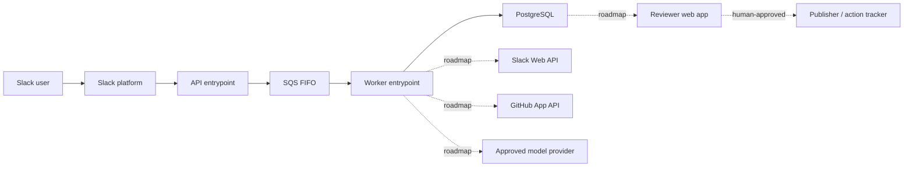
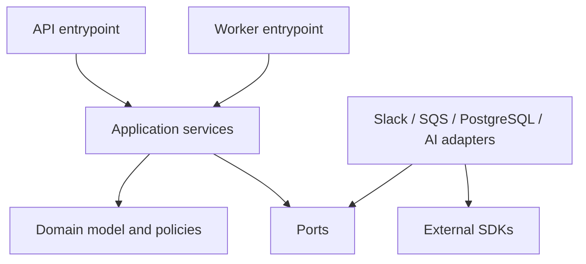
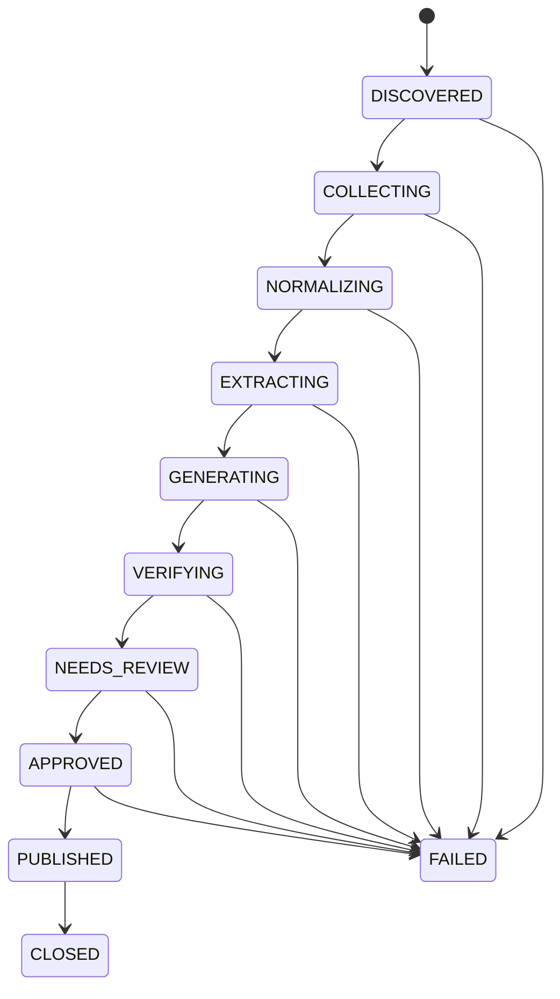

# Incident Evidence Copilot architecture

Status: foundation architecture  
Last updated: 2026-07-17

## Purpose

Incident Evidence Copilot turns an explicitly triggered Slack incident conversation into a durable, reviewable incident-processing job. The product will eventually combine Slack and operational evidence, extract structured claims, and prepare a source-linked postmortem for human approval.

The foundation deliberately solves the ingestion and reliability problem before the generative-AI problem:

1. authenticate the caller;
2. accept the event quickly;
3. enqueue one durable unit of work;
4. process it idempotently;
5. persist an auditable state transition; and
6. keep source content out of operational logs.

This document describes both the implemented foundation and the intended product architecture. A component marked **roadmap** is not part of the current security or reliability claim.

## Product boundary

The service is an incident-reconstruction overlay. It is not an incident-management platform.

In scope:

- a user-triggered Slack workflow;
- permission-aware evidence collection;
- durable asynchronous processing;
- structured, evidence-linked claims and timelines;
- provider-neutral AI integration;
- a human review gate before publication; and
- follow-up action creation after approval.

Explicitly out of scope:

- paging, on-call scheduling, or status-page management;
- autonomous diagnosis or remediation;
- unrestricted workspace search;
- direct-message ingestion;
- automated publication of model output;
- a general-purpose document editor; and
- a general enterprise-search index.

## What is implemented and what is not

“Implemented” means the foundation contains the corresponding code boundary and testable behavior. It does not mean that a production AWS account, Slack workspace, or model-provider account has been provisioned.

### Implemented foundation

- A strict TypeScript single-package modular monolith with separate Fastify API and SQS worker entrypoints.
- A Slack ingress boundary that verifies signed requests before accepting work.
- Replay protection based on Slack's signed request timestamp.
- Parsing for Slack URL-verification requests and `app_mention` incident-review commands.
- An initial fail-closed Slack-ID guard that accepts `C`-prefixed channel IDs only, ignores `G`/`D`/unknown prefixes, and ignores unrelated event types.
- A Zod-validated, versioned `incident.review.requested` queue contract.
- SQS FIFO producer and consumer adapters with explicit at-least-once delivery semantics.
- An idempotent worker application service backed by PostgreSQL uniqueness and optimistic concurrency.
- An `IncidentAggregate` with explicit lifecycle states and controlled transitions.
- Tenant-keyed PostgreSQL schemas for installations, incidents, source artifacts, timeline events, claims, evidence links, workflow jobs, and audits, with composite foreign keys preventing cross-tenant associations.
- An incident repository whose every query carries tenant scope, plus checksum-verified, advisory-lock-protected SQL migrations.
- A vendor-neutral, Zod-validated incident-analysis contract; no model SDK is coupled to domain logic.
- Zod-validated, process-specific environment configuration.
- Liveness and readiness endpoints.
- Structured Pino logging with request logging disabled and sensitive-field redaction.
- Docker/local Compose, CI, and unit-test foundations.
- Dependency direction that keeps domain logic independent of Fastify, Slack, AWS, PostgreSQL, and model vendors.

### Deliberately not implemented yet

- Slack OAuth installation and token lifecycle management.
- Historical Slack thread or channel collection.
- GitHub App evidence collection.
- Production AI extraction, claim generation, or report writing.
- Evidence comparison and contradiction detection.
- The reviewer web application.
- Publication to an external document system.
- Action-item creation.
- Private-channel or direct-message processing.
- Automatic source discovery.
- Production AWS infrastructure provisioning and deployment.

The roadmap is tracked in [roadmap.md](./roadmap.md). Threats that become relevant as these capabilities are introduced are tracked in [threat-model.md](./threat-model.md).

## Architecture principles

### Evidence precedes prose

The system must first create an evidence record and a structured claim graph. Generated prose is a view over those structures. A writing model must not introduce incident-specific facts that are absent from the reviewed claim graph.

### Source data is untrusted

Slack messages, pasted logs, file contents, link titles, GitHub comments, and model output are data. None are instructions to the runtime. They must not be allowed to select tools, alter permissions, publish documents, or execute code.

### Acknowledgement is separate from processing

Slack should receive a successful acknowledgement after authentication and durable queue acceptance, not after evidence collection or AI generation. The synchronous API path has a small, predictable latency budget; all variable work belongs in the worker.

### At-least-once delivery is normal

Neither Slack retries nor queue delivery provide exactly-once execution. Correctness comes from stable identifiers, database uniqueness constraints, and transactional state transitions—not from assuming a message is delivered once.

### Permissions can only narrow

A derived artifact must never disclose evidence to an audience broader than the evidence's permitted audience. The initial product avoids the hardest case by accepting public Slack channels only and by not publishing automatically. Later publication must be policy-checked and human-approved.

### Model providers are replaceable infrastructure

Domain types describe extraction and generation requests. Provider adapters translate those requests to a selected model API. Prompts, response schemas, retry policy, and model metadata are recorded independently of a provider SDK.

### Observability excludes payloads

Logs and trace attributes may include correlation IDs, hashed stable identifiers, state, duration, sizes, and error classifications. They must not contain message text, OAuth tokens, signatures, queue bodies, model prompts, model responses, or generated documents.

## System context



Solid lines are the foundation execution path. Dashed lines are planned integrations.

## Foundation request flow

```mermaid
sequenceDiagram
    autonumber
    participant Slack
    participant API
    participant FIFO as SQS FIFO
    participant Worker
    participant DB as PostgreSQL

    Slack->>API: Raw signed HTTP request
    API->>API: Verify timestamp and HMAC over raw body
    API->>API: Parse and apply initial C-prefix channel guard
    API->>FIFO: Enqueue typed job with stable deduplication ID
    FIFO-->>API: Durable acceptance
    API-->>Slack: HTTP 2xx

    FIFO->>Worker: Deliver job (possibly more than once)
    Worker->>DB: Acquire idempotency key / create job
    alt first valid attempt
        Worker->>DB: Transition job through allowed states
        Worker-->>FIFO: Acknowledge after durable completion
    else duplicate or terminal job
        Worker->>DB: Read existing outcome
        Worker-->>FIFO: Acknowledge without repeating effects
    else retryable failure
        Worker->>DB: Record safe failure metadata
        Worker--xFIFO: Do not acknowledge; retry later
    end
```

The API must preserve the exact raw request bytes for signature verification. Parsing or re-serialising JSON before verification changes the signed bytes and invalidates the security boundary.

## Runtime components

### API entrypoint

Responsibilities:

- expose Fastify liveness, readiness, and Slack ingress endpoints;
- capture the raw HTTP body;
- validate Slack's versioned HMAC signature with constant-time comparison;
- reject timestamps outside the replay window;
- handle Slack URL-verification challenges without queueing work;
- recognise explicit `app_mention` commands while acknowledging unrelated Slack events;
- validate the minimal event envelope;
- enforce the initial `C`-prefixed channel guard;
- create a content-free correlation context;
- enqueue a typed message; and
- return a small response.

It must not:

- call a model;
- retrieve channel history;
- publish a document;
- perform long database workflows; or
- log the raw request, headers, or queue body.

### FIFO queue

SQS FIFO is the load-leveling and durability boundary between ingress and processing.

The queue message should be versioned and contain only fields required by the consumer. A representative envelope is:

```ts
interface IncidentReviewRequestedV1 {
  type: 'incident.review.requested';
  version: 1;
  jobId: string;
  tenantId: string;
  requestedAt: string;
  requestedTitle: string;
  source: {
    provider: 'slack';
    eventId: string;
    workspaceId: string;
    channelId: string;
    messageTs: string;
    threadTs?: string;
    userId: string;
  };
}
```

The contract is strict and Zod validated at the consumer boundary. `source.eventId` plus workspace is the business idempotency identity. `jobId` identifies an individual accepted command; it must not be the only duplicate-suppression key because Slack retries may cause ingress to generate another job ID.

Queue policy:

- use a stable deduplication ID derived from workspace and event ID;
- use a message group that preserves the smallest ordering scope the workflow requires;
- configure a dead-letter queue and bounded receive count;
- set visibility timeout above the expected worker lease and extend it for long work;
- encrypt the queue with KMS in production;
- restrict send permission to the API role and receive/delete permission to the worker role; and
- never place OAuth credentials or Slack signing secrets in a message.

FIFO deduplication reduces duplicate deliveries within its broker window; it does not replace database idempotency.

### Worker entrypoint

Responsibilities:

- validate the queue schema and supported version;
- acquire a durable job using the business idempotency key;
- reject tenant/workspace mismatches;
- perform only allowed state transitions;
- record attempt metadata without recording source content;
- classify failures as retryable or terminal;
- acknowledge a queue message only after durable completion; and
- treat duplicate delivery as a successful no-op when prior work is terminal.

Roadmap responsibilities include evidence collection, structured AI extraction, validation, and notifying a reviewer. Those steps must be checkpointed so a retry does not repeat completed external side effects.

### PostgreSQL

PostgreSQL is the initial system of record for tenant configuration, incident jobs, evidence metadata, claims, review decisions, and publications.

The foundation requires at least:

- a unique constraint over the stable event identity;
- an explicit job state, version, attempt count, and timestamps;
- atomic job acquisition or transition;
- safe error codes rather than raw exception or payload storage; and
- migrations reviewed with the application change that consumes them.

The implemented migration runner serialises concurrent migrators with a database advisory lock, runs each migration transactionally, and records a SHA-256 checksum. Editing, renaming, or removing an already applied migration is therefore an integrity failure rather than silent schema drift.

Future source content, if stored at all, belongs in a separately classified evidence snapshot with a retention deadline and collection authority. It must not be casually added to a generic JSON job column.

### AI gateway

The foundation exposes provider-neutral interfaces but intentionally has no production model behavior. The gateway will later own:

- model selection;
- schema-constrained request and response translation;
- timeouts and retry budgets;
- prompt and schema versioning;
- usage and cost metadata;
- sensitive-data policy; and
- provider-specific error normalisation.

The gateway does not own claim truth, permissions, or publication decisions. Its output is untrusted until domain validation and human review.

## Module boundaries and dependency direction

The modular monolith uses ports and adapters within one npm package and deployable codebase:



Dependency rules:

1. Domain modules import no framework, cloud, Slack, database, or model SDK.
2. Application services depend on domain modules and interfaces.
3. Adapters implement interfaces and translate external errors into application error types.
4. Entrypoints perform composition and lifecycle management; they do not contain business rules.
5. Cross-module writes pass through an application service rather than reaching into another module's tables.
6. Network and time are injected dependencies in tests.

The rationale is recorded in [ADR 0001](./adr/0001-modular-monolith.md).

## Incident state model

The implemented `IncidentAggregate` owns the end-to-end lifecycle vocabulary, even though the current worker advances only from `DISCOVERED` to `COLLECTING`:



`CLOSED` and `FAILED` are terminal. `PUBLISHED` can transition only to `CLOSED`. The aggregate returns immutable snapshots, increments an optimistic version on each transition, and rejects every transition not present in the state table.

Rules:

- later phases must not bypass the aggregate by directly updating a status column;
- a duplicate source event reuses the existing incident rather than creating a second one;
- persistence uses the expected version to reject stale concurrent writes;
- state changes and associated outbox records should share one database transaction when external effects are introduced;
- a worker crash may cause SQS redelivery, but the uniqueness key and optimistic version make reprocessing safe; and
- error records contain classifications and correlation IDs, not raw source material.

## Data model and classification

### Foundation records and schemas

| Record              | Purpose                                                                   | Sensitive fields                                        | Current status                                          |
| ------------------- | ------------------------------------------------------------------------- | ------------------------------------------------------- | ------------------------------------------------------- |
| Tenant              | Isolation root and lifecycle                                              | organisation identity                                   | schema implemented                                      |
| Slack installation  | Workspace grant and encrypted bot-token metadata                          | token ciphertext, scopes, installing user               | schema implemented; OAuth flow is roadmap               |
| Incident            | Stable idempotency, tenant/source identity, lifecycle, optimistic version | Slack identifiers and requested title                   | schema and repository implemented                       |
| Source artifact     | Tenant-safe source metadata and optional snapshot                         | restricted content when collection is enabled           | schema implemented; collection is roadmap               |
| Timeline event      | Normalised event/report time and classification                           | generated incident detail                               | schema implemented; extraction is roadmap               |
| Claim               | Structured incident statement, classification, and review state           | generated or human-authored incident detail             | schema implemented; model generation and review roadmap |
| Claim-evidence link | Support, contradiction, or context relation                               | relationship rationale                                  | schema implemented; population is roadmap               |
| Workflow job        | Durable attempt, lock, retry, and result metadata                         | payload/result fields must follow restricted-data rules | schema implemented; current SQS path keys on incidents  |
| Audit event         | Append-oriented security/business event                                   | actor and target metadata                               | schema implemented; complete audit emission is roadmap  |

The schema uses `(tenant_id, incident_id, ...)` composite foreign keys so evidence, timeline events, claims, and links cannot be associated across tenants even if application code supplies mismatched IDs. The repository also includes `tenant_id` in every incident read and write. Row-level security remains a later defence-in-depth requirement for multi-tenant production.

### Planned records and runtime behavior

| Record         | Purpose                            | Important invariant                     |
| -------------- | ---------------------------------- | --------------------------------------- |
| Human decision | Approval, rejection, or correction | model cannot create it                  |
| Publication    | External artifact metadata         | audience policy checked before creation |

Data classification:

- **Secret:** Slack signing secret, OAuth access/refresh tokens, model-provider keys, database credentials.
- **Restricted:** message content, generated drafts, file content, incident evidence, model prompts/responses.
- **Confidential metadata:** workspace, channel, user, repository, incident, and permalink identifiers.
- **Operational metadata:** internal job IDs, durations, version numbers, counts, and enumerated error classes.

Only operational metadata is allowed in standard logs. Identifiers should be hashed or omitted where they are not necessary for diagnosis.

## Trust boundaries

1. **Internet to API:** untrusted bytes become authenticated Slack input only after signature and replay validation.
2. **API to queue:** authenticated input becomes an internal versioned command; IAM and queue encryption protect transport and storage.
3. **Queue to worker:** messages remain untrusted because producers or stored messages may be compromised; schema and tenant validation run again.
4. **Worker to database:** parameterised repository methods and tenant-scoped access protect durable state.
5. **Worker to source APIs (roadmap):** OAuth grants authorize retrieval; each artifact retains its source and permission metadata.
6. **Worker to model provider (roadmap):** restricted data leaves the product boundary under an explicit tenant and provider policy.
7. **Review to publication (roadmap):** a human decision plus an audience policy changes a draft into an external artifact.

## Idempotency and consistency

Stable identity should be derived from immutable source identifiers, for example:

```text
slack-event:{workspace_id}:{event_id}
```

The database uniqueness constraint is authoritative. The implementation should insert-or-read atomically and must not use a check-then-insert sequence.

For future external effects:

- use an outbox record committed with the domain state;
- give each publication or issue creation a stable idempotency key;
- persist the external resource ID before acknowledging completion;
- reconcile ambiguous timeouts instead of blindly retrying; and
- distinguish “requested,” “confirmed,” and “failed” states.

The system offers eventual consistency between Slack acknowledgement, background processing, and reviewer availability. It does not offer a distributed transaction across Slack, AWS, GitHub, a model provider, and PostgreSQL.

## Error handling and retry policy

Errors are categorised rather than retried uniformly:

| Category             | Examples                                               | Behavior                                     |
| -------------------- | ------------------------------------------------------ | -------------------------------------------- |
| Invalid input        | bad schema, unsupported event type, private channel    | reject or terminal failure; no retry         |
| Authentication       | invalid signature, expired timestamp                   | reject at ingress; security metric           |
| Authorization        | source not permitted, tenant mismatch                  | fail closed; audit                           |
| Throttling           | Slack or provider rate limit                           | honour retry hint, add jitter, retry         |
| Transient dependency | timeout, connection reset, temporary database failover | bounded exponential backoff                  |
| Permanent dependency | revoked token, deleted repository                      | terminal or wait for operator action         |
| Model contract       | malformed structured output                            | bounded repair/retry, then quarantine        |
| Programming defect   | invariant violation                                    | fail safely, alert, do not loop indefinitely |

Retries require a budget. A dead-lettered message is an operational incident to inspect, not an alternative long-term queue.

## Observability

Every accepted trigger receives an internal correlation ID. Metrics and traces should expose:

- ingress requests by verification outcome and event type;
- acknowledgement latency;
- queue send latency and failures;
- queue age, depth, receive count, and dead-letter count;
- worker attempt latency and outcome;
- idempotency conflicts and duplicate suppression;
- job counts by state;
- dependency latency and throttling by provider;
- AI token, cost, latency, and schema-failure metrics when enabled; and
- time from trigger to review-ready draft when that workflow exists.

Safe structured log example:

```json
{
  "level": "info",
  "event": "incident_job_completed",
  "correlationId": "01J...",
  "jobId": "8c1...",
  "attempt": 1,
  "durationMs": 284
}
```

Unsafe fields include `requestBody`, `messageText`, `authorization`, `cookie`, `slackSignature`, `queueBody`, `prompt`, and `modelResponse`.

## Deployment topology

The intended first production topology is:

- API service on ECS Fargate behind an Application Load Balancer;
- worker service on ECS Fargate with no public ingress;
- SQS FIFO queue and dead-letter queue;
- RDS PostgreSQL in private subnets;
- Secrets Manager for credentials;
- KMS for queue, database, secret, and evidence encryption;
- least-privilege task roles for API and worker;
- OpenTelemetry export to an approved observability backend; and
- Terraform-managed infrastructure.

The API and worker use the same release artifact but different entrypoint commands. They can be deployed and scaled independently. This provides failure and scaling isolation without introducing distributed domain ownership.

Development can use test doubles or local emulators, but parity limitations must be documented. In-memory queues are not evidence that FIFO redelivery, visibility timeouts, or IAM policies work.

## Scaling model

The expected load is bursty around incidents but modest in aggregate. Scale independently on:

- API request rate and latency;
- visible queue depth and oldest-message age; and
- worker concurrency constrained by Slack/provider rate limits and database capacity.

Use bounded concurrency per workspace to prevent one tenant from consuming all downstream quota. The FIFO message group must not be the entire application unless global serialization is intended; that would create head-of-line blocking.

PostgreSQL remains appropriate until measured contention, dataset size, or isolation requirements justify a change. `pgvector` may later support similar-incident retrieval, but is not required for the ingestion foundation.

## Availability and recovery

Initial proposed objectives—not yet measured service-level commitments—are:

- Slack ingress availability: 99.9%;
- valid trigger durable acceptance: 99.9%;
- normal incident draft latency: under five minutes after the AI workflow exists;
- recovery point objective: under fifteen minutes; and
- recovery time objective: under four hours.

Recovery design:

- automated PostgreSQL backups and point-in-time recovery;
- infrastructure recreated from reviewed Terraform;
- queue retention long enough to survive normal outages;
- worker replay safe because processing is idempotent;
- dead-letter redrive requires an operator and records an audit event; and
- restore tests are scheduled, because an untested backup is only an assumption.

## Key tradeoffs and failure modes

### FIFO queue versus standard queue

FIFO provides an explicit ordering and broker deduplication model, useful for a resume-quality implementation of retried webhooks. It costs throughput and can cause head-of-line blocking when message groups are too broad. Database idempotency remains necessary either way.

### PostgreSQL versus specialised stores

PostgreSQL keeps transactions, constraints, review state, and future vector lookup together. It avoids premature operational complexity. A large evidence corpus may eventually need object storage and a dedicated search index, but introducing them before measured need would weaken rather than strengthen the foundation.

### Modular monolith versus microservices

Separate API and worker processes isolate latency and scaling. Keeping domain modules in one codebase preserves transactional clarity and makes refactoring cheap while the product model is still changing. The cost is that module boundaries require discipline rather than network enforcement.

### Public channels only

The implemented foundation uses Slack's channel-ID prefix as a narrow first guard: only `C`-prefixed IDs create work; `G`, `D`, and unknown prefixes fail closed. This is appropriate for the local foundation but is not a sufficient production authorization source. OAuth-enabled collection must confirm conversation metadata through Slack's authorized API and installation policy before reading history.

Restricting the initial path meaningfully reduces permission-composition risk, but public workspace channels can still contain secrets or customer information. “Public” is an access scope, not a data classification. Sensitive-data controls and retention still apply.

### AI adapter without AI behavior

The foundation proves integration seams, not model quality. This is intentional. A production provider should be connected only after an evaluation corpus and structured-output contract exist.

### Human review later

Until the review experience exists, no generated incident report should be described as authoritative or published automatically. The lack of publication is a safety property, not a missing shortcut.

## Architecture fitness checks

The following checks should become CI or deployment gates:

- domain packages do not import external SDKs;
- Slack signature tests cover valid, altered, stale, missing, and malformed requests;
- logs are tested for source-content and secret leakage;
- queue consumers accept known schema versions and reject unknown ones;
- duplicate message tests prove only one durable job and one external effect;
- illegal job state transitions fail;
- repository methods require a tenant/workspace scope;
- migrations apply to an empty and a representative existing database;
- AI adapter contract tests use schema-invalid and prompt-injection fixtures;
- publication tests prove an unreviewed draft cannot leave the system;
- production collection tests prove conversation visibility from authorized Slack metadata rather than relying only on an ID prefix; and
- threat-model review is required when adding a source or destination connector.

## Open decisions

These require evidence from design partners or implementation measurements:

- whether trigger text is necessary in the queue or can be fetched after acceptance;
- the minimum operational retention for trigger jobs;
- whether evidence snapshots are stored in PostgreSQL or encrypted object storage;
- which model providers meet customer retention requirements;
- the publication audience calculation for destinations without readable ACL APIs;
- the per-workspace concurrency and rate-limit policy; and
- whether a workflow engine becomes justified once collection and review stages are resumable.
