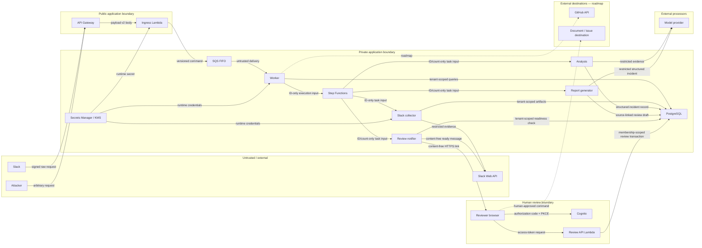

# Threat model

Status: active; collection, AI extraction, human revision, and approval controls implemented
Last updated: 2026-07-19

## Scope

This threat model covers the Incident Evidence Copilot foundation:

```text
Slack signed request -> API Gateway -> ingress Lambda -> SQS FIFO -> worker Lambda -> PostgreSQL + Step Functions -> collector + analysis + report + notification Lambdas -> Slack/OpenAI APIs + PostgreSQL -> Cognito-authenticated review console/API
```

Triggering-thread history collection, structured model extraction,
evidence-constrained draft generation, a content-free ready notification, and
tenant-authorized human revision/approval are implemented. This model also
includes configurable human-approved Confluence/Notion publication and anticipates selected-channel
Slack collection, GitHub evidence,
and follow-up issue creation.
Planned controls are not credited as current protection.

This is an engineering threat model, not a compliance certification or penetration-test result.

## Security objectives

In priority order:

1. Do not expose Slack content, incident evidence, credentials, or generated reports to an unauthorised party.
2. Do not allow an unauthenticated or replayed request to create work.
3. Do not let one workspace read or affect another workspace's data.
4. Do not execute source-content instructions or permit a model to grant access, publish, or remediate.
5. Do not create duplicate external effects when events or queue messages are retried.
6. Preserve enough metadata to investigate security-sensitive actions without copying source content into logs.
7. Fail closed when identity, tenant, source permission, destination audience, or model output is ambiguous.

## Assets

| Asset                                     | Classification           | Why it matters                                                                    |
| ----------------------------------------- | ------------------------ | --------------------------------------------------------------------------------- |
| Slack signing secret                      | Secret                   | authenticates every workspace request to the ingress boundary                     |
| Slack OAuth tokens                        | Secret                   | may permit reading workspace content                                              |
| GitHub App key and installation tokens    | Secret                   | permit repository evidence access and later issue creation                        |
| Model-provider credentials                | Secret                   | permit billable calls and data transfer                                           |
| Slack messages and file contents          | Restricted               | may contain customer data, credentials, vulnerabilities, or personnel information |
| Incident claims and generated drafts      | Restricted               | may reveal architecture, failures, customer impact, or incorrect allegations      |
| Evidence permissions and review decisions | Confidential             | determine who may see or approve derived content                                  |
| Workspace/channel/user/repository IDs     | Confidential metadata    | allow correlation of organisations, teams, and incidents                          |
| Job and audit metadata                    | Operational/confidential | required for reliability and investigation                                        |
| Application and infrastructure integrity  | Critical                 | compromise can bypass every product-level control                                 |

## Actors

- A legitimate Slack user in an installed workspace.
- A legitimate reviewer or administrator.
- An external attacker without workspace access.
- A malicious or compromised workspace member.
- A malicious tenant attempting cross-tenant access.
- A compromised third-party integration or dependency.
- An operator with infrastructure access.
- A model provider or its compromised service.
- Untrusted content author whose message or file enters the evidence set.

## Assumptions

Known design assumptions:

- Slack signing secrets are delivered through a secret manager in production.
- TLS terminates only at approved infrastructure and the application receives the original request body.
- AWS IAM policies separate API send permission from worker receive/delete permission.
- PostgreSQL credentials are secret-managed and its public Supabase pooler is
  reached only with certificate-chain and hostname verification.
- The initial Slack trigger policy accepts public channels only.
- No model output is published automatically.
- The model runtime has no tools and cannot create a human-confirmed record.
- Review API production deployments use a dedicated non-owner PostgreSQL role;
  the Terraform development fallback to a shared database secret is not a
  production isolation control.

Unproven assumptions that must be validated during deployment:

- the HTTP framework and proxy preserve the exact signed bytes;
- infrastructure logs do not capture headers or bodies before application redaction;
- queue and database encryption use intended customer-managed or organisation-managed KMS keys;
- backup, restore, secret rotation, and revocation procedures work;
- Slack currently preserves the documented `C`/`G`/`D` identifier distinction used by the foundation guard; production collection will replace that assumption with authorized conversation metadata; and
- production dependencies are patched within the declared response window.

## Trust boundaries and data flows



Every arrow crossing a box boundary requires authentication, authorisation, schema validation, encrypted transport, and content-safe observability appropriate to the data class.

## Foundation threats and controls

### Spoofed Slack requests

Threat: an attacker sends a plausible event payload directly to the public endpoint, causing resource consumption or fabricated incidents.

Implemented controls:

- verify Slack's `v0` HMAC signature over `v0:{timestamp}:{rawBody}`;
- compare signatures using a constant-time operation;
- reject missing, malformed, or unsupported signature versions;
- do not parse or act on the event before signature validation; and
- keep the signing secret outside source control.

Failure mode: middleware parses or normalises the body before verification. The signature either fails for legitimate traffic or, worse, a second unverified representation reaches business logic.

Required test: a one-byte body change must fail validation even when the parsed JSON is semantically equivalent.

### Replay attacks

Threat: a captured valid request is sent repeatedly.

Implemented controls:

- reject signed timestamps outside a narrow replay window;
- use Slack's event ID plus workspace ID as the durable idempotency key; and
- suppress duplicate work at the database, not only in the FIFO broker.

Residual risk: an on-path attacker who can replay within the time window still reaches queue acceptance, but durable processing remains a no-op. TLS and network controls remain necessary.

### Private-channel or direct-message ingestion

Threat: the app processes content whose visibility and destination audience have not been designed.

Implemented controls:

- accept `app_mention` review commands only when the channel ID begins with `C`;
- ignore `G`-prefixed private/group conversations, `D`-prefixed DMs, and unknown prefixes; and
- do not provide a configuration flag that silently bypasses the policy.

Required before onboarding external workspaces or expanding history collection:

- resolve conversation metadata using the authorized Slack API and installation policy;
- fail closed when the API cannot establish the conversation type;
- treat Slack Connect as a separate policy case; and
- do not use the ID prefix as the final source-authorization decision.

Residual risk: triggering-thread collection currently relies on the signed
event's `C` prefix plus a workspace-bound bot grant. That is a coarse guard, not
a complete conversation-type or data-classification proof. This is acceptable
for a controlled single-workspace development deployment, but not sufficient
authorization for an externally onboarded multi-tenant product. Public channels
can still contain sensitive information.

### Queue tampering, poison messages, and schema confusion

Threat: a compromised producer, stale deployment, or malformed body causes the worker to process an unsafe command.

Implemented controls:

- a versioned queue schema;
- validation again at the worker boundary;
- least-privilege queue IAM;
- immutable source/workspace identity fields;
- bounded receives and a dead-letter queue design; and
- terminal handling for unsupported schema versions.

Production requirements:

- server-side encryption, with a customer-managed KMS key when policy requires
  customer-controlled key lifecycle;
- a resource policy that denies non-TLS access;
- API role can send but cannot receive or purge;
- worker role can receive/delete but cannot alter queue policy; and
- alarms on oldest-message age and dead-letter count.

### Duplicate or out-of-order processing

Threat: Slack retries, SQS redelivery, a worker crash, or visibility timeout creates multiple jobs or repeats external side effects.

Implemented controls:

- database unique constraint on the business event identity;
- atomic acquire/create semantics;
- legal state transitions;
- terminal duplicate delivery is a no-op; and
- FIFO ordering is scoped deliberately.
- Slack artifacts use a stable workspace/channel/message identity and a
  database unique constraint;
- artifact upserts and optimistic page-cursor advancement share one PostgreSQL
  transaction; and
- a completed checkpoint returns without calling Slack again.

Roadmap control:

- transactional outbox and idempotency keys for publication and issue creation.

The evidence is strong that at-least-once delivery occurs in real systems; the exact duplicate frequency in this workload is unknown.

### Cross-tenant access

Threat: a job, query, cache key, or URL from workspace A reads or mutates workspace B.

Foundation controls:

- workspace identity is part of the durable idempotency key;
- repository operations require explicit workspace/tenant scope;
- worker rejects envelope-to-record workspace mismatch; and
- identifiers are opaque and not treated as authorisation;
- incident repository statements include `tenant_id`; and
- composite foreign keys prevent evidence, timeline, claim, and audit associations from crossing tenant boundaries.

Required before multi-tenant production:

- tenant context established from authenticated identity, never a caller-supplied body field alone;
- PostgreSQL row-level security or an equivalent independently enforced boundary;
- tenant context included in KMS encryption context and object-store prefix;
- negative integration tests for every read and write endpoint;
- no globally shared model cache containing customer content; and
- audited break-glass operations.

### Source content in logs or traces

Threat: message text, prompts, queue bodies, signatures, or credentials are copied into a broadly accessible observability system.

Implemented controls:

- Fastify's automatic request logging is disabled;
- the request serializer emits only request ID, method, and URL;
- known body, credential, token, signing-secret, and database-URL paths are redacted;
- application success events log operational identifiers rather than message text; and
- raw bodies, headers, queue messages, prompts, and model responses are forbidden by policy.

Production requirements:

- replace arbitrary dependency-error serialization at source boundaries with stable error classes/codes; a third-party error message may embed input even when request logging is disabled;
- verify load balancer, WAF, proxy, APM, error-reporting, and database slow-query logs;
- scan representative logs in CI or a test environment;
- restrict and audit observability access; and
- apply retention shorter than source-system retention where practical.

Failure mode: application logs are clean while ingress, tracing auto-instrumentation, or an error SDK records the body. The control must be verified end to end.

### Secret theft

Threat: source code, logs, environment inspection, crash dumps, CI output, or overly broad IAM exposes credentials.

Foundation controls:

- secrets are injected, not committed;
- secret values are excluded from error messages and logs;
- adapters receive only the credential they require; and
- production architecture uses Secrets Manager and KMS.

Required controls:

- separate credentials by environment;
- short-lived GitHub installation tokens;
- Slack token revocation handling;
- rotation runbooks and automated rotation where supported;
- CI secret scanning;
- no secrets in Terraform state outputs; and
- task roles instead of static AWS access keys.

### Resource exhaustion and denial of service

Threat: valid or invalid events consume HTTP connections, queue capacity, database connections, downstream quota, or model budget.

Controls:

- reject unauthenticated traffic before queueing;
- strict body-size and request-time limits;
- small synchronous work budget;
- queue-based load leveling;
- bounded worker concurrency and database pools;
- per-workspace quotas;
- bounded retries with jitter; and
- model token and cost limits before AI is enabled.

Tradeoff: a single FIFO message group provides simple ordering but permits head-of-line blocking. Grouping must be narrow enough to isolate unrelated incidents or workspaces.

### Database injection and state corruption

Threat: untrusted identifiers or source text alter queries, or concurrent workers perform illegal transitions.

Controls:

- parameterised queries through a repository boundary;
- database constraints for uniqueness and valid values;
- atomic compare-and-transition operations;
- immutable, checksum-verified migrations serialised with an advisory lock;
- minimal database role privileges;
- migrations applied through CI/CD rather than runtime string construction; and
- restricted content stored separately from operational metadata.

Required tests include hostile Unicode, unusually long identifiers, concurrent acquisition, stale state versions, and duplicate insert races.

### Dependency and build compromise

Threat: an npm package, container base, CI action, or build credential introduces code execution or exfiltration.

Controls required before deployment:

- lockfile and reproducible installs;
- dependency, license, secret, SAST, and container scanning;
- minimal runtime image and non-root user;
- pinned CI actions by immutable version;
- protected branches and required reviews;
- generated software bill of materials;
- restricted package lifecycle scripts where feasible; and
- signed release provenance.

## AI and evidence threats

### Triggering-thread evidence collection

Implemented controls:

- fixed Slack API endpoints prevent source text or identifiers from selecting a
  destination host;
- strict identifier, cursor, response-size, response-schema, permalink-host,
  redirect, and timeout validation;
- workspace binding is checked before the bot token is sent;
- one 15-message page per invocation and bounded permalink concurrency;
- Slack retry hints become Step Functions waits instead of sleeping compute;
- source content remains in `source_artifacts`, not Step Functions state or
  operational logs; and
- evidence carries canonical identity, timestamps, a content hash, and a
  retention deadline.

Known gap: the deadline is recorded but not enforced by a deletion process yet.
Slack uninstall/revocation handling, conversation metadata authorization, and
backup-deletion semantics are also not implemented. The bot token has the union
of the app's Slack scopes even though separate Lambda roles restrict which
application adapter receives it; AWS IAM cannot narrow capabilities inside that
Slack-issued token.

## AI threats

### Prompt injection through evidence

Threat: a Slack message, pasted log, file, PR description, or linked page tells the model to ignore policy, reveal another incident, call a tool, or publish content.

Implemented controls:

- label source material as untrusted data in every model contract;
- separate system policy from evidence payloads;
- no provider tool calling in extraction;
- schema-constrained output with strict parsing;
- never execute commands, URLs, SQL, or instructions emitted by a model;
- use application-owned fixed provider/source endpoints rather than model-selected
  URLs;
- report generation consumes validated structured claims, timeline events, and
  questions rather than raw Slack text;
- report output rejects URLs, HTML, secret-like tokens, and unknown source IDs;
  and
- neither model adapter has Slack, approval, publication, or tool authority.

Adversarial unit fixtures and a ten-case versioned synthetic offline evaluation
corpus exist. A human-labelled corpus and live-provider adversarial baseline
remain release gaps.

Prompt text is a weak control by itself. Tool and publication authority must be absent from the model runtime.

### Hallucinated or overstated claims

Threat: plausible prose asserts impact, causality, timing, ownership, or remediation that evidence does not support.

Implemented controls:

- extraction creates evidence-linked structured claims before prose;
- timeline events require citations and non-hypothetical factual claims require
  supporting evidence;
- classifications distinguish observation, assertion, hypothesis, inference, dispute, unknown, and human-confirmed cause;
- supporting and contradicting references are kept separate;
- unknowns remain visible; and
- model output cannot use the human-confirmed classification;
- report statements must reference known claims or timeline events, may not use
  a stronger classification than their sources, and must surface every
  disputed or contradicted claim;
- deterministic rendering adds explicit uncertainty and source labels; and
- report completion and all provenance links commit atomically before the
  incident reaches `NEEDS_REVIEW`.

Deterministic structural evaluation is implemented, but semantic entailment
validation and human review are not. Therefore a cited claim can still
misrepresent its source, and no generated result is authoritative.

Numeric confidence scores must not be exposed unless calibrated against a labelled corpus.

### Cross-tenant model leakage

Threat: provider retention, prompt caching, application caches, fine-tuning, or debugging surfaces customer A's data to customer B.

Required controls:

- provider contractual no-training and retention settings;
- tenant and incident isolation in application caches;
- no unrestricted prompt/response logging;
- explicit provider-region and data-residency configuration;
- content minimisation before provider calls;
- separate production and development provider projects; and
- a kill switch that disables model calls without disabling incident ingestion.

Current controls tenant-scope the manifest query and every evidence reference,
pseudonymise explicit Slack author IDs before provider submission, keep prompts
and responses out of workflow/log state, and use separate secret/IAM boundaries.
Provider contractual controls, regional endpoint selection, sensitivity
classification, and a graceful kill switch remain gaps.

### Sensitive content sent to a provider

Threat: secrets, credentials, personal data, security incident details, or regulated information leave the organisation unexpectedly.

Required controls:

- tenant-configured provider policy;
- sensitivity classification and secret detection;
- stable redaction placeholders where redaction preserves meaning;
- field- and source-level minimisation;
- do not fetch attachments by default;
- audit model invocation metadata without storing prompt bodies; and
- block or route high-sensitivity incidents to a customer-approved deployment.

Secret detection is probabilistic and cannot be represented as a complete guarantee.

### Draft notification leakage or duplication

Threat: a ready notification discloses incident content, posts into the wrong
workspace/thread, or repeats after a retry.

Implemented controls:

- the notifier reloads the tenant-scoped incident and exact tenant/incident/draft
  row and requires both to be `NEEDS_REVIEW` before sending;
- destination workspace, channel, and thread are taken from the stored incident,
  not trusted from workflow input;
- displayed counts are taken from the stored draft, not workflow input;
- the message is application-owned and content-free; and
- the durable report draft ID is used as Slack's stable client message ID.

A terminal Slack notification failure does not roll back or regenerate the
draft. The message now includes an HTTPS review-console link containing only the
opaque incident UUID. The link is navigation, not authorization; Cognito plus
active tenant membership still gates every read.

## Review and publication threats

### Permission laundering

Threat: a user combines evidence from multiple audiences into a report visible to a larger audience.

Required invariant:

```text
permitted_report_readers <= intersection(permitted_readers(each included source))
```

Publication controls still required:

- retain source visibility metadata with every evidence link;
- publish first into a restricted review area;
- authenticate reviewer identity and re-check current permissions;
- allow only pre-approved destinations;
- obtain destination audience through a trusted API where possible;
- block automatic publication when destination readers are unknown;
- require explicit human approval for redacted broader-audience reports; and
- audit source set, reviewer, policy result, destination, and external ID.

The current development path implements a single configured destination,
human approval, a transactional outbox, and durable external IDs. It does not
inspect the Confluence/Notion reader set or revalidate Slack source ACLs at publication
time. That is a known release blocker for external multi-tenant production, not
an assurance supplied by a provider credential. Confluence development uses a
dedicated, space-restricted service account and scoped API token routed through
the fixed Atlassian Cloud-ID gateway; the site origin is retained only for
validated human-facing links. A distributable multi-tenant product requires
centrally managed OAuth 2.0 rather than customer API-token collection.

Paraphrasing private evidence does not make it public.

### Model impersonates human approval

Threat: generated text, injected content, or a forged API call marks a cause as confirmed or publishes a document.

Implemented controls:

- human decisions are a distinct record type created only from an authenticated review action;
- OAuth state and PKCE, a short-lived access token kept in session storage, and
  no ambient cookie credential on review mutations;
- server-side authorisation on every review mutation;
- immutable decision actor and timestamp;
- no model adapter has a publication or approval port; and
- publication requires an approved draft version, not merely an incident ID.

### Insecure direct object reference

Threat: changing an incident, evidence, or publication ID in the review UI exposes another tenant's data.

Implemented controls:

- derive tenant context from authenticated membership;
- tenant-scope every query;
- opaque IDs are convenience, not security;
- indistinguishable not-found responses for unauthorized incident IDs; and
- focused negative API and repository tests.

Still required before external multi-tenant production are PostgreSQL row-level
defence in depth, signed short-lived attachment access if file evidence is
introduced, and a full cross-tenant integration suite against a real database.

### SSRF and malicious links

Threat: source messages include URLs to cloud metadata, localhost, internal admin services, or malicious redirects.

Implemented review-link controls:

- the browser never fetches source URLs through the application;
- displayed links are limited to HTTPS Slack and GitHub origins with no
  credentials or alternate ports; and
- all untrusted content is rendered through `textContent`, never HTML.

Controls required before arbitrary-link collection:

- do not fetch arbitrary URLs;
- use source-specific APIs and allowlisted hosts;
- resolve and validate every redirect and IP;
- block private, loopback, link-local, and metadata ranges;
- constrain response size, content type, and time; and
- sandbox file parsing.

## Privacy, deletion, and retention threats

Threats:

- retaining evidence after Slack or a customer deletes it;
- retaining derived claims after source deletion;
- backups silently extending retention;
- development fixtures containing real customer content;
- an exported report outliving the source permissions; and
- employee access without a support justification.

Required controls:

- record collection authority and expiry per evidence snapshot;
- default to references rather than copied content where feasible;
- implement tenant-configured retention;
- propagate deletion or mark derived artifacts stale when notified;
- document backup deletion semantics honestly;
- use synthetic or irreversibly anonymised test fixtures;
- audit privileged reads;
- support workspace uninstall and token revocation; and
- disclose that external publications follow the destination's retention policy.

## Abuse cases

| Abuse case                                                 | Expected behavior                                                                              |
| ---------------------------------------------------------- | ---------------------------------------------------------------------------------------------- |
| Attacker submits unsigned incident payload                 | reject before parsing business event or queueing                                               |
| Valid request replayed 100 times                           | one durable job; duplicates produce no repeated effect                                         |
| Trigger arrives with a `D`, `G`, or unknown channel prefix | ignore with no incident job; production collection revalidates Slack conversation metadata     |
| Queue message claims another workspace ID                  | fail closed and emit content-free security event                                               |
| Slack message says “ignore policy and publish secrets”     | treat as evidence text; no tools or publication authority                                      |
| Model returns valid JSON plus an invented cause            | support validator flags or removes claim; human cannot publish silently                        |
| Reviewer changes incident ID in URL                        | tenant-scoped authorization denies access                                                      |
| Destination ACL cannot be inspected                        | block automatic publication                                                                    |
| Worker times out after creating an issue                   | reconcile using stable idempotency key; do not blindly create a second issue                   |
| Source connector token is revoked                          | stop collection, mark source unavailable, preserve partial result and notify operator/reviewer |

## Security verification plan

### Foundation release gates

- Unit tests for valid, stale, malformed, altered, and missing Slack signatures.
- Raw-body preservation integration test through the actual HTTP framework.
- `C`/`G`/`D`/unknown channel-prefix policy tests, followed by authorized conversation-metadata tests when collection is enabled.
- Duplicate event and concurrent worker tests against PostgreSQL.
- Queue schema-version rejection tests.
- Log capture tests asserting that source text, secrets, raw bodies, and queue bodies are absent.
- Database migration and rollback/recovery rehearsal.
- IAM policy review for API, worker, queue, database, secret, and KMS access.
- Dependency and container scans with documented exception policy.

### AI release gates

- Deterministic synthetic prompt-injection and schema-confusion fixtures
  (implemented; keep versioned in CI).
- Report source-coverage, contradiction, ordering, causal-overstatement, and
  forbidden-output measurements (implemented structurally).
- Human-labelled incident evaluation corpus and evidence-entailment baseline
  (still required before factual-quality claims).
- Sensitive-data leakage tests.
- Provider retention and region review.
- Kill-switch exercise.

### Review/publication release gates

- Focused JWT, tenant-membership, ID-mismatch, body-boundary, stale-version, and
  atomic-rollback tests (implemented); a real-database cross-tenant suite is
  still required.
- OAuth state/PKCE and restrictive browser response headers are implemented;
  an independent browser security review is still required.
- Source-to-destination ACL policy tests.
- Model cannot create human decision records (implemented at the application
  port/schema boundary; production database-role isolation must be verified).
- Ambiguous-timeout and duplicate-publication tests.
- External artifact deletion and revocation runbook.

## Residual risks and honest limitations

- Valid Slack signatures authenticate Slack as the sender, not the truth of message content.
- Public Slack channels may contain highly sensitive data.
- HMAC replay windows reduce but do not remove replay attempts; idempotency limits their effect.
- Content classifiers and secret scanners have false negatives and false positives.
- Evidence support does not prove objective causality.
- Passing the offline synthetic harness does not prove semantic accuracy or
  real-world completeness.
- Report notification failure can leave a valid draft ready without a Slack
  signal; the review inbox still exposes it, but operators need notification
  failure telemetry.
- Development may reuse the pipeline PostgreSQL credential for the review API.
  That is convenient, not least privilege. Production Terraform rejects this
  fallback, and operators must also ensure the pipeline credential is not a
  database owner capable of bypassing table grants.
- Browser access tokens are exposed to any successful same-origin XSS. A strict
  CSP and `textContent` rendering reduce this risk but do not eliminate it.
- A compromised application runtime can access data available to its role; infrastructure hardening and detection remain necessary.
- Human reviewers can make mistakes or intentionally approve an unsafe report.
- External publication creates a new copy governed by the destination system.
- Third-party providers remain supply-chain and availability dependencies.

These risks must not be obscured by describing the product as “secure by AI” or “hallucination free.”

## Ownership and update triggers

The engineering owner updates this model when any of the following occurs:

- a new source or destination connector is added;
- private channels, Slack Connect, DMs, files, or arbitrary links enter scope;
- a model provider or model tool is enabled;
- source content begins to be persisted;
- the reviewer UI or publication path is introduced;
- multi-tenant production is enabled;
- retention or deployment region changes;
- an incident reveals an unmodelled abuse case; or
- a major architectural decision changes a trust boundary.
